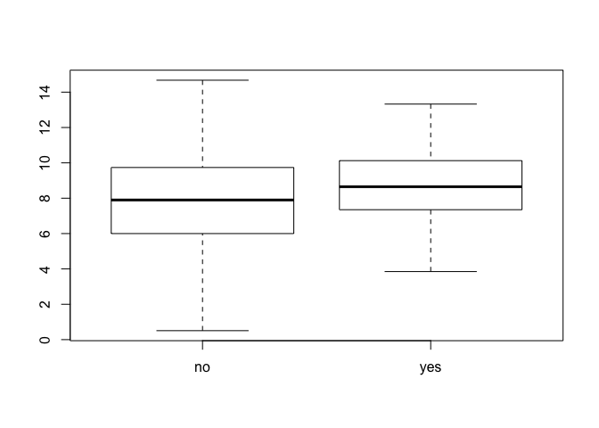
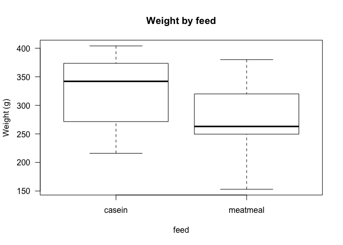
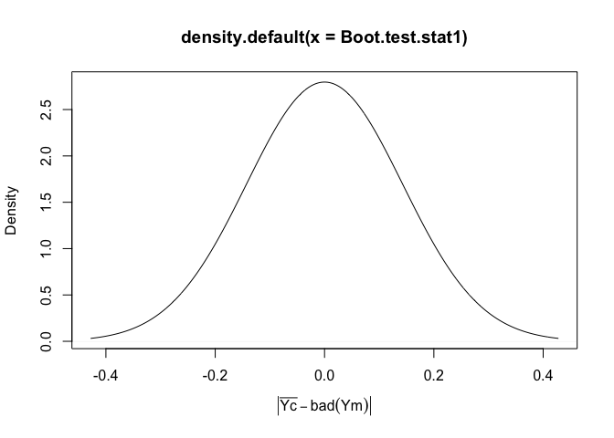

# 4.3 

```r
library(tidyverse)
```

```
## Warning: package 'tidyverse' was built under R version 3.5.2
```

```
## ── Attaching packages ───────────────────────────────────────────────────────────────────── tidyverse 1.3.0 ──
```

```
## ✔ ggplot2 3.3.0     ✔ purrr   0.3.3
## ✔ tibble  2.1.3     ✔ dplyr   0.8.5
## ✔ tidyr   1.0.2     ✔ stringr 1.4.0
## ✔ readr   1.3.1     ✔ forcats 0.4.0
```

```
## Warning: package 'ggplot2' was built under R version 3.5.2
```

```
## Warning: package 'tibble' was built under R version 3.5.2
```

```
## Warning: package 'tidyr' was built under R version 3.5.2
```

```
## Warning: package 'purrr' was built under R version 3.5.2
```

```
## Warning: package 'dplyr' was built under R version 3.5.2
```

```
## Warning: package 'stringr' was built under R version 3.5.2
```

```
## Warning: package 'forcats' was built under R version 3.5.2
```

```
## ── Conflicts ──────────────────────────────────────────────────────────────────────── tidyverse_conflicts() ──
## ✖ dplyr::filter() masks stats::filter()
## ✖ dplyr::lag()    masks stats::lag()
```


```r
LungCapData <- read.delim("~/Downloads/LungCapData.txt")
```


```r
boxplot(LungCapData$LungCap~LungCapData$Smoke)
```

<!-- -->

### Ho: Median Lung Capcity of Smokers = that of non smokers


```r
wilcox.test(LungCapData$LungCap~LungCapData$Smoke, mu = 0, alt="two.sided", conf.int=T, conf.level=0.95, paired=F, exact=T, correct=T)
```

```
## Warning in wilcox.test.default(x = c(6.475, 9.55, 11.125, 4.8, 6.225,
## 4.95, : cannot compute exact p-value with ties
```

```
## Warning in wilcox.test.default(x = c(6.475, 9.55, 11.125, 4.8, 6.225,
## 4.95, : cannot compute exact confidence intervals with ties
```

```
## 
## 	Wilcoxon rank sum test with continuity correction
## 
## data:  LungCapData$LungCap by LungCapData$Smoke
## W = 20128, p-value = 0.005538
## alternative hypothesis: true location shift is not equal to 0
## 95 percent confidence interval:
##  -1.3999731 -0.2499419
## sample estimates:
## difference in location 
##             -0.8000564
```

```r
wilcox.test(LungCapData$LungCap~LungCapData$Smoke, mu = 0, alt="two.sided", conf.int=T, conf.level=0.95, paired=F, exact=F, correct=T)
```

```
## 
## 	Wilcoxon rank sum test with continuity correction
## 
## data:  LungCapData$LungCap by LungCapData$Smoke
## W = 20128, p-value = 0.005538
## alternative hypothesis: true location shift is not equal to 0
## 95 percent confidence interval:
##  -1.3999731 -0.2499419
## sample estimates:
## difference in location 
##             -0.8000564
```
### Initital settings are the default except conf.int = T

# 4.4

```r
cd <- read.csv("~/Downloads/ChickData.csv") 
```


```r
boxplot(cd$weight~cd$feed, las =1, ylab="Weight (g)", xlab="feed", main="Weight by feed")
```

<!-- -->
### calculate the difference in sample means

```r
mean(cd$weight[cd$feed =="casein"])
```

```
## [1] 323.5833
```

```r
mean(cd$weight[cd$feed =="meatmeal"])
```

```
## [1] 276.9091
```

```r
test.stat1 <- abs(mean(cd$weight[cd$feed =="casein"])-mean(cd$weight[cd$feed =="meatmeal"]))
```

```r
test.stat1
```

```
## [1] 46.67424
```

```r
median(cd$weight[cd$feed =="casein"])
```

```
## [1] 342
```

```r
median(cd$weight[cd$feed =="meatmeal"])
```

```
## [1] 263
```

```r
test.stat2 <- abs(median(cd$weight[cd$feed =="casein"])-median(cd$weight[cd$feed =="meatmeal"]))
```

```r
test.stat2
```

```
## [1] 79
```


###Bootstrapping

```r
set.seed(112358) # for reproducibility
```

```r
n <- length(cd$feed) # number of observations to sample
n
```

```
## [1] 23
```

```r
B <- 10000 # of bootstrap samples
variable <- cd$weight #the vairable we will sample from
```
### Now get those boostrap samples (w/o loops)

```r
BootstrapSamples <- matrix(sample(variable, size = n*B, replace=T), nrow=n,ncol=B)
```
### lets take a moment to discuss what that code is doing

```r
dim(BootstrapSamples)
```

```
## [1]    23 10000
```
### now calculate the means for each of the bootstrap samples

```r
dim(BootstrapSamples)
```

```
## [1]    23 10000
```

```r
Boot.test.stat1 <- rep(0, B)
Boot.test.stat2 <- rep(0, B)
```
   

```r
test.stat1; test.stat2
```

```
## [1] 46.67424
```

```
## [1] 79
```

```r
round(Boot.test.stat1[1:20],1)
```

```
##  [1] 0 0 0 0 0 0 0 0 0 0 0 0 0 0 0 0 0 0 0 0
```

```r
round(Boot.test.stat2[1:20],1)
```

```
##  [1] 0 0 0 0 0 0 0 0 0 0 0 0 0 0 0 0 0 0 0 0
```

```r
(Boot.test.stat1 >= test.stat1)[1:20]
```

```
##  [1] FALSE FALSE FALSE FALSE FALSE FALSE FALSE FALSE FALSE FALSE FALSE
## [12] FALSE FALSE FALSE FALSE FALSE FALSE FALSE FALSE FALSE
```

```r
mean(Boot.test.stat1 >= test.stat1)
```

```
## [1] 0
```

```r
mean(Boot.test.stat2 >= test.stat2)
```

```
## [1] 0
```

```r
table(cd$feed)
```

```
## 
##   casein meatmeal 
##       12       11
```

```r
plot(density(Boot.test.stat1), xlab=expression(group("|", bar(Yc)-bad(Ym), "|")))
```

<!-- -->

# 4.5

```r
Obs.Diff.In.Means <- abs(mean(cd$weight[cd$feed =="casein"])-mean(cd$weight[cd$feed =="meatmeal"]))
Obs.Diff.In.Means
```

```
## [1] 46.67424
```

```r
Obs.Diff.In.Medians <- abs(median(cd$weight[cd$feed =="casein"])-median(cd$weight[cd$feed =="meatmeal"]))
Obs.Diff.In.Medians
```

```
## [1] 79
```

```r
set.seed(13579)
n.c <- 12 # number of obs to sample from casein
n.m <- 11 # number of obs to sample from meatmeal
B <- 100000
```

```r
Boot.casein <- matrix(sample(cd$weight[cd$feed=="casein"], size=B*n.c, replace=T), ncol=B, nrow=n.c)
```

```r
Boot.meatmeal <- matrix(sample(cd$weight[cd$feed=="meatmeal"], size=B*n.m, replace=T), ncol=B, nrow=n.m)
```

```r
dim(Boot.casein); dim(Boot.meatmeal) #Checking the dimensions
```

```
## [1]     12 100000
```

```
## [1]     11 100000
```
### Check to make sure they aren't empty

```r
Boot.casein[1:5, 1:5]
```

```
##      [,1] [,2] [,3] [,4] [,5]
## [1,]  390  222  379  379  222
## [2,]  283  359  260  404  260
## [3,]  390  352  260  216  318
## [4,]  283  222  222  379  283
## [5,]  404  390  260  318  379
```

```r
Boot.meatmeal[1:5,1:5]
```

```
##      [,1] [,2] [,3] [,4] [,5]
## [1,]  242  344  344  153  303
## [2,]  344  303  315  315  206
## [3,]  153  242  263  380  242
## [4,]  303  242  258  344  344
## [5,]  344  325  315  344  263
```
### calculate the diff in means for each of the bootsamples

```r
Boot.Diff.In.Means <- colMeans(Boot.casein)-colMeans(Boot.meatmeal)
length(Boot.Diff.In.Means) #check the length
```

```
## [1] 100000
```

```r
Boot.Diff.In.Means[1:10] #lookin at first ten
```

```
##  [1] 75.43939 23.03030 33.71970 54.30303 34.84848 40.58333 45.36364
##  [8] 79.65909 82.45455 19.20455
```
### now do same for estimate humber 2

```r
Boot.Diff.In.Medians <- apply(Boot.casein, MARGIN=2, FUN=median) - apply(Boot.meatmeal, MARGIN=2, FUN=median)
length(Boot.Diff.In.Medians)
```

```
## [1] 100000
```

```r
Boot.Diff.In.Medians[1:10]
```

```
##  [1]  90.0  29.0  79.0  53.0  55.0  52.5  82.5 103.0  94.0  69.0
```
### Making the confidence intervals (will be using the percentile method)

```r
quantile(Boot.Diff.In.Means, prob=.025)
```

```
##      2.5% 
## -4.007955
```

```r
quantile(Boot.Diff.In.Means, prob=0.975)
```

```
##    97.5% 
## 96.82595
```

```r
quantile(Boot.Diff.In.Medians, prob=.025)
```

```
##  2.5% 
## -24.5
```

```r
quantile(Boot.Diff.In.Medians, prob=0.975)
```

```
## 97.5% 
##   116
```
# R for DATA Science Questions
## 19.2.1 3

```r
avg_NA <- function(x) {mean(is.na(x))}
avg_NA(c(1,2,3,4,5,NA,NA,NA))
```

```
## [1] 0.375
```

```r
percent_total <- function(x) {
  sm <- sum(x, na.rm = TRUE)
  (x/sm)}
percent_total(c(1,2,3,4,5))
```

```
## [1] 0.06666667 0.13333333 0.20000000 0.26666667 0.33333333
```

```r
variation_coeff <- function(x) {
  s<- sd(x, na.rm = TRUE)
  m<- mean(x, na.rm =TRUE)
  (s/m)}
```

```r
variation_coeff((c(1,2,3,4,5)))
```

```
## [1] 0.5270463
```
## 19.4.4
- I am sorry. I don't have anything for either of these questions.I just don't know how you could set up an argument of whether or not x is divisible by 3/5 or is at a certain time in comparison to current time. I looked up code online, but I don't get it. :p
## 21.2.1 1
A.

```r
mtcars_avg <- vector("double", ncol(mtcars))  
for (i in seq_along(mtcars)) {            
  mtcars_avg[[i]] <- mean(mtcars[[i]])     
}
mtcars_avg
```

```
##  [1]  20.090625   6.187500 230.721875 146.687500   3.596563   3.217250
##  [7]  17.848750   0.437500   0.406250   3.687500   2.812500
```
B.

```r
iris
```

```
##     Sepal.Length Sepal.Width Petal.Length Petal.Width    Species
## 1            5.1         3.5          1.4         0.2     setosa
## 2            4.9         3.0          1.4         0.2     setosa
## 3            4.7         3.2          1.3         0.2     setosa
## 4            4.6         3.1          1.5         0.2     setosa
## 5            5.0         3.6          1.4         0.2     setosa
## 6            5.4         3.9          1.7         0.4     setosa
## 7            4.6         3.4          1.4         0.3     setosa
## 8            5.0         3.4          1.5         0.2     setosa
## 9            4.4         2.9          1.4         0.2     setosa
## 10           4.9         3.1          1.5         0.1     setosa
## 11           5.4         3.7          1.5         0.2     setosa
## 12           4.8         3.4          1.6         0.2     setosa
## 13           4.8         3.0          1.4         0.1     setosa
## 14           4.3         3.0          1.1         0.1     setosa
## 15           5.8         4.0          1.2         0.2     setosa
## 16           5.7         4.4          1.5         0.4     setosa
## 17           5.4         3.9          1.3         0.4     setosa
## 18           5.1         3.5          1.4         0.3     setosa
## 19           5.7         3.8          1.7         0.3     setosa
## 20           5.1         3.8          1.5         0.3     setosa
## 21           5.4         3.4          1.7         0.2     setosa
## 22           5.1         3.7          1.5         0.4     setosa
## 23           4.6         3.6          1.0         0.2     setosa
## 24           5.1         3.3          1.7         0.5     setosa
## 25           4.8         3.4          1.9         0.2     setosa
## 26           5.0         3.0          1.6         0.2     setosa
## 27           5.0         3.4          1.6         0.4     setosa
## 28           5.2         3.5          1.5         0.2     setosa
## 29           5.2         3.4          1.4         0.2     setosa
## 30           4.7         3.2          1.6         0.2     setosa
## 31           4.8         3.1          1.6         0.2     setosa
## 32           5.4         3.4          1.5         0.4     setosa
## 33           5.2         4.1          1.5         0.1     setosa
## 34           5.5         4.2          1.4         0.2     setosa
## 35           4.9         3.1          1.5         0.2     setosa
## 36           5.0         3.2          1.2         0.2     setosa
## 37           5.5         3.5          1.3         0.2     setosa
## 38           4.9         3.6          1.4         0.1     setosa
## 39           4.4         3.0          1.3         0.2     setosa
## 40           5.1         3.4          1.5         0.2     setosa
## 41           5.0         3.5          1.3         0.3     setosa
## 42           4.5         2.3          1.3         0.3     setosa
## 43           4.4         3.2          1.3         0.2     setosa
## 44           5.0         3.5          1.6         0.6     setosa
## 45           5.1         3.8          1.9         0.4     setosa
## 46           4.8         3.0          1.4         0.3     setosa
## 47           5.1         3.8          1.6         0.2     setosa
## 48           4.6         3.2          1.4         0.2     setosa
## 49           5.3         3.7          1.5         0.2     setosa
## 50           5.0         3.3          1.4         0.2     setosa
## 51           7.0         3.2          4.7         1.4 versicolor
## 52           6.4         3.2          4.5         1.5 versicolor
## 53           6.9         3.1          4.9         1.5 versicolor
## 54           5.5         2.3          4.0         1.3 versicolor
## 55           6.5         2.8          4.6         1.5 versicolor
## 56           5.7         2.8          4.5         1.3 versicolor
## 57           6.3         3.3          4.7         1.6 versicolor
## 58           4.9         2.4          3.3         1.0 versicolor
## 59           6.6         2.9          4.6         1.3 versicolor
## 60           5.2         2.7          3.9         1.4 versicolor
## 61           5.0         2.0          3.5         1.0 versicolor
## 62           5.9         3.0          4.2         1.5 versicolor
## 63           6.0         2.2          4.0         1.0 versicolor
## 64           6.1         2.9          4.7         1.4 versicolor
## 65           5.6         2.9          3.6         1.3 versicolor
## 66           6.7         3.1          4.4         1.4 versicolor
## 67           5.6         3.0          4.5         1.5 versicolor
## 68           5.8         2.7          4.1         1.0 versicolor
## 69           6.2         2.2          4.5         1.5 versicolor
## 70           5.6         2.5          3.9         1.1 versicolor
## 71           5.9         3.2          4.8         1.8 versicolor
## 72           6.1         2.8          4.0         1.3 versicolor
## 73           6.3         2.5          4.9         1.5 versicolor
## 74           6.1         2.8          4.7         1.2 versicolor
## 75           6.4         2.9          4.3         1.3 versicolor
## 76           6.6         3.0          4.4         1.4 versicolor
## 77           6.8         2.8          4.8         1.4 versicolor
## 78           6.7         3.0          5.0         1.7 versicolor
## 79           6.0         2.9          4.5         1.5 versicolor
## 80           5.7         2.6          3.5         1.0 versicolor
## 81           5.5         2.4          3.8         1.1 versicolor
## 82           5.5         2.4          3.7         1.0 versicolor
## 83           5.8         2.7          3.9         1.2 versicolor
## 84           6.0         2.7          5.1         1.6 versicolor
## 85           5.4         3.0          4.5         1.5 versicolor
## 86           6.0         3.4          4.5         1.6 versicolor
## 87           6.7         3.1          4.7         1.5 versicolor
## 88           6.3         2.3          4.4         1.3 versicolor
## 89           5.6         3.0          4.1         1.3 versicolor
## 90           5.5         2.5          4.0         1.3 versicolor
## 91           5.5         2.6          4.4         1.2 versicolor
## 92           6.1         3.0          4.6         1.4 versicolor
## 93           5.8         2.6          4.0         1.2 versicolor
## 94           5.0         2.3          3.3         1.0 versicolor
## 95           5.6         2.7          4.2         1.3 versicolor
## 96           5.7         3.0          4.2         1.2 versicolor
## 97           5.7         2.9          4.2         1.3 versicolor
## 98           6.2         2.9          4.3         1.3 versicolor
## 99           5.1         2.5          3.0         1.1 versicolor
## 100          5.7         2.8          4.1         1.3 versicolor
## 101          6.3         3.3          6.0         2.5  virginica
## 102          5.8         2.7          5.1         1.9  virginica
## 103          7.1         3.0          5.9         2.1  virginica
## 104          6.3         2.9          5.6         1.8  virginica
## 105          6.5         3.0          5.8         2.2  virginica
## 106          7.6         3.0          6.6         2.1  virginica
## 107          4.9         2.5          4.5         1.7  virginica
## 108          7.3         2.9          6.3         1.8  virginica
## 109          6.7         2.5          5.8         1.8  virginica
## 110          7.2         3.6          6.1         2.5  virginica
## 111          6.5         3.2          5.1         2.0  virginica
## 112          6.4         2.7          5.3         1.9  virginica
## 113          6.8         3.0          5.5         2.1  virginica
## 114          5.7         2.5          5.0         2.0  virginica
## 115          5.8         2.8          5.1         2.4  virginica
## 116          6.4         3.2          5.3         2.3  virginica
## 117          6.5         3.0          5.5         1.8  virginica
## 118          7.7         3.8          6.7         2.2  virginica
## 119          7.7         2.6          6.9         2.3  virginica
## 120          6.0         2.2          5.0         1.5  virginica
## 121          6.9         3.2          5.7         2.3  virginica
## 122          5.6         2.8          4.9         2.0  virginica
## 123          7.7         2.8          6.7         2.0  virginica
## 124          6.3         2.7          4.9         1.8  virginica
## 125          6.7         3.3          5.7         2.1  virginica
## 126          7.2         3.2          6.0         1.8  virginica
## 127          6.2         2.8          4.8         1.8  virginica
## 128          6.1         3.0          4.9         1.8  virginica
## 129          6.4         2.8          5.6         2.1  virginica
## 130          7.2         3.0          5.8         1.6  virginica
## 131          7.4         2.8          6.1         1.9  virginica
## 132          7.9         3.8          6.4         2.0  virginica
## 133          6.4         2.8          5.6         2.2  virginica
## 134          6.3         2.8          5.1         1.5  virginica
## 135          6.1         2.6          5.6         1.4  virginica
## 136          7.7         3.0          6.1         2.3  virginica
## 137          6.3         3.4          5.6         2.4  virginica
## 138          6.4         3.1          5.5         1.8  virginica
## 139          6.0         3.0          4.8         1.8  virginica
## 140          6.9         3.1          5.4         2.1  virginica
## 141          6.7         3.1          5.6         2.4  virginica
## 142          6.9         3.1          5.1         2.3  virginica
## 143          5.8         2.7          5.1         1.9  virginica
## 144          6.8         3.2          5.9         2.3  virginica
## 145          6.7         3.3          5.7         2.5  virginica
## 146          6.7         3.0          5.2         2.3  virginica
## 147          6.3         2.5          5.0         1.9  virginica
## 148          6.5         3.0          5.2         2.0  virginica
## 149          6.2         3.4          5.4         2.3  virginica
## 150          5.9         3.0          5.1         1.8  virginica
```

```r
iris$Species = as.character(iris$Species) 
iris_types <- vector("character", ncol(iris))  # 1. output
for (i in seq_along(iris)) {            # 2. sequence
  iris_types[[i]] <- typeof(iris[[i]])      # 3. body
}
iris_types
```

```
## [1] "double"    "double"    "double"    "double"    "character"
```
- I don't know what's up with this one. It's correct for the first four, but for the fifth column it says its an integer even though it is a factor. And I can't make a vector out of a factor for some reason. I converted Species to character just because all the inputs are names, plus it works with the loop I made.

## 21.3.5 3

```r
iris_2 <- select(iris, Sepal.Width, Sepal.Length, Petal.Length, Petal.Width)
iris_2
```

```
##     Sepal.Width Sepal.Length Petal.Length Petal.Width
## 1           3.5          5.1          1.4         0.2
## 2           3.0          4.9          1.4         0.2
## 3           3.2          4.7          1.3         0.2
## 4           3.1          4.6          1.5         0.2
## 5           3.6          5.0          1.4         0.2
## 6           3.9          5.4          1.7         0.4
## 7           3.4          4.6          1.4         0.3
## 8           3.4          5.0          1.5         0.2
## 9           2.9          4.4          1.4         0.2
## 10          3.1          4.9          1.5         0.1
## 11          3.7          5.4          1.5         0.2
## 12          3.4          4.8          1.6         0.2
## 13          3.0          4.8          1.4         0.1
## 14          3.0          4.3          1.1         0.1
## 15          4.0          5.8          1.2         0.2
## 16          4.4          5.7          1.5         0.4
## 17          3.9          5.4          1.3         0.4
## 18          3.5          5.1          1.4         0.3
## 19          3.8          5.7          1.7         0.3
## 20          3.8          5.1          1.5         0.3
## 21          3.4          5.4          1.7         0.2
## 22          3.7          5.1          1.5         0.4
## 23          3.6          4.6          1.0         0.2
## 24          3.3          5.1          1.7         0.5
## 25          3.4          4.8          1.9         0.2
## 26          3.0          5.0          1.6         0.2
## 27          3.4          5.0          1.6         0.4
## 28          3.5          5.2          1.5         0.2
## 29          3.4          5.2          1.4         0.2
## 30          3.2          4.7          1.6         0.2
## 31          3.1          4.8          1.6         0.2
## 32          3.4          5.4          1.5         0.4
## 33          4.1          5.2          1.5         0.1
## 34          4.2          5.5          1.4         0.2
## 35          3.1          4.9          1.5         0.2
## 36          3.2          5.0          1.2         0.2
## 37          3.5          5.5          1.3         0.2
## 38          3.6          4.9          1.4         0.1
## 39          3.0          4.4          1.3         0.2
## 40          3.4          5.1          1.5         0.2
## 41          3.5          5.0          1.3         0.3
## 42          2.3          4.5          1.3         0.3
## 43          3.2          4.4          1.3         0.2
## 44          3.5          5.0          1.6         0.6
## 45          3.8          5.1          1.9         0.4
## 46          3.0          4.8          1.4         0.3
## 47          3.8          5.1          1.6         0.2
## 48          3.2          4.6          1.4         0.2
## 49          3.7          5.3          1.5         0.2
## 50          3.3          5.0          1.4         0.2
## 51          3.2          7.0          4.7         1.4
## 52          3.2          6.4          4.5         1.5
## 53          3.1          6.9          4.9         1.5
## 54          2.3          5.5          4.0         1.3
## 55          2.8          6.5          4.6         1.5
## 56          2.8          5.7          4.5         1.3
## 57          3.3          6.3          4.7         1.6
## 58          2.4          4.9          3.3         1.0
## 59          2.9          6.6          4.6         1.3
## 60          2.7          5.2          3.9         1.4
## 61          2.0          5.0          3.5         1.0
## 62          3.0          5.9          4.2         1.5
## 63          2.2          6.0          4.0         1.0
## 64          2.9          6.1          4.7         1.4
## 65          2.9          5.6          3.6         1.3
## 66          3.1          6.7          4.4         1.4
## 67          3.0          5.6          4.5         1.5
## 68          2.7          5.8          4.1         1.0
## 69          2.2          6.2          4.5         1.5
## 70          2.5          5.6          3.9         1.1
## 71          3.2          5.9          4.8         1.8
## 72          2.8          6.1          4.0         1.3
## 73          2.5          6.3          4.9         1.5
## 74          2.8          6.1          4.7         1.2
## 75          2.9          6.4          4.3         1.3
## 76          3.0          6.6          4.4         1.4
## 77          2.8          6.8          4.8         1.4
## 78          3.0          6.7          5.0         1.7
## 79          2.9          6.0          4.5         1.5
## 80          2.6          5.7          3.5         1.0
## 81          2.4          5.5          3.8         1.1
## 82          2.4          5.5          3.7         1.0
## 83          2.7          5.8          3.9         1.2
## 84          2.7          6.0          5.1         1.6
## 85          3.0          5.4          4.5         1.5
## 86          3.4          6.0          4.5         1.6
## 87          3.1          6.7          4.7         1.5
## 88          2.3          6.3          4.4         1.3
## 89          3.0          5.6          4.1         1.3
## 90          2.5          5.5          4.0         1.3
## 91          2.6          5.5          4.4         1.2
## 92          3.0          6.1          4.6         1.4
## 93          2.6          5.8          4.0         1.2
## 94          2.3          5.0          3.3         1.0
## 95          2.7          5.6          4.2         1.3
## 96          3.0          5.7          4.2         1.2
## 97          2.9          5.7          4.2         1.3
## 98          2.9          6.2          4.3         1.3
## 99          2.5          5.1          3.0         1.1
## 100         2.8          5.7          4.1         1.3
## 101         3.3          6.3          6.0         2.5
## 102         2.7          5.8          5.1         1.9
## 103         3.0          7.1          5.9         2.1
## 104         2.9          6.3          5.6         1.8
## 105         3.0          6.5          5.8         2.2
## 106         3.0          7.6          6.6         2.1
## 107         2.5          4.9          4.5         1.7
## 108         2.9          7.3          6.3         1.8
## 109         2.5          6.7          5.8         1.8
## 110         3.6          7.2          6.1         2.5
## 111         3.2          6.5          5.1         2.0
## 112         2.7          6.4          5.3         1.9
## 113         3.0          6.8          5.5         2.1
## 114         2.5          5.7          5.0         2.0
## 115         2.8          5.8          5.1         2.4
## 116         3.2          6.4          5.3         2.3
## 117         3.0          6.5          5.5         1.8
## 118         3.8          7.7          6.7         2.2
## 119         2.6          7.7          6.9         2.3
## 120         2.2          6.0          5.0         1.5
## 121         3.2          6.9          5.7         2.3
## 122         2.8          5.6          4.9         2.0
## 123         2.8          7.7          6.7         2.0
## 124         2.7          6.3          4.9         1.8
## 125         3.3          6.7          5.7         2.1
## 126         3.2          7.2          6.0         1.8
## 127         2.8          6.2          4.8         1.8
## 128         3.0          6.1          4.9         1.8
## 129         2.8          6.4          5.6         2.1
## 130         3.0          7.2          5.8         1.6
## 131         2.8          7.4          6.1         1.9
## 132         3.8          7.9          6.4         2.0
## 133         2.8          6.4          5.6         2.2
## 134         2.8          6.3          5.1         1.5
## 135         2.6          6.1          5.6         1.4
## 136         3.0          7.7          6.1         2.3
## 137         3.4          6.3          5.6         2.4
## 138         3.1          6.4          5.5         1.8
## 139         3.0          6.0          4.8         1.8
## 140         3.1          6.9          5.4         2.1
## 141         3.1          6.7          5.6         2.4
## 142         3.1          6.9          5.1         2.3
## 143         2.7          5.8          5.1         1.9
## 144         3.2          6.8          5.9         2.3
## 145         3.3          6.7          5.7         2.5
## 146         3.0          6.7          5.2         2.3
## 147         2.5          6.3          5.0         1.9
## 148         3.0          6.5          5.2         2.0
## 149         3.4          6.2          5.4         2.3
## 150         3.0          5.9          5.1         1.8
```

```r
iris_2_means <- vector("list", length(iris_2))
for (i in seq_along(iris_2)) {
  iris_2_means[[i]] <- mean(iris_2[[i]])
}
iris_2_means
```

```
## [[1]]
## [1] 3.057333
## 
## [[2]]
## [1] 5.843333
## 
## [[3]]
## [1] 3.758
## 
## [[4]]
## [1] 1.199333
```

```r
iris_2_means_map <- map_dbl(iris_2, mean)
iris_2_means_map
```

```
##  Sepal.Width Sepal.Length Petal.Length  Petal.Width 
##     3.057333     5.843333     3.758000     1.199333
```
- I was unable to figure out how to name the subsections of the list. So, I just used the map_dbl function cause I knew the column names would be included. Also, I didn't know how else to exclude the Species column other than using select beforehand.
## 21.5.3 1
A.

```r
mtcars_avg_2 <- map_dbl(mtcars, mean)
mtcars_avg_2
```

```
##        mpg        cyl       disp         hp       drat         wt 
##  20.090625   6.187500 230.721875 146.687500   3.596563   3.217250 
##       qsec         vs         am       gear       carb 
##  17.848750   0.437500   0.406250   3.687500   2.812500
```
B.

```r
iris_types_2 <- map_chr(iris, typeof)
iris_types_2 
```

```
## Sepal.Length  Sepal.Width Petal.Length  Petal.Width      Species 
##     "double"     "double"     "double"     "double"  "character"
```


