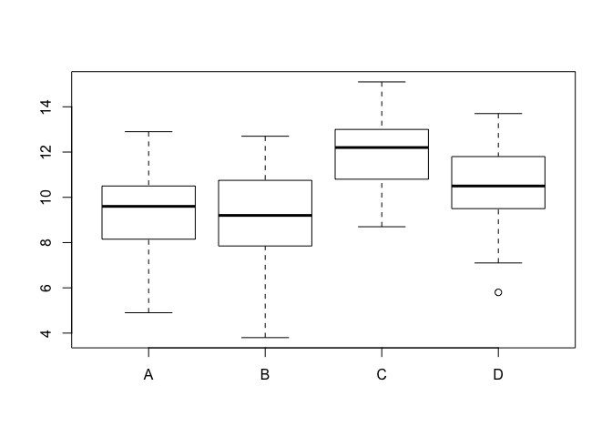
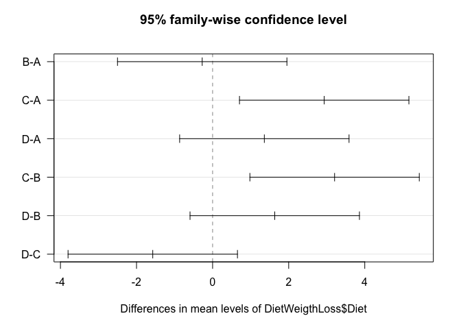
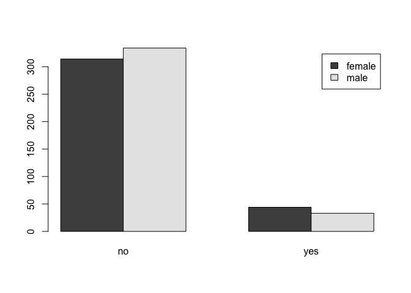
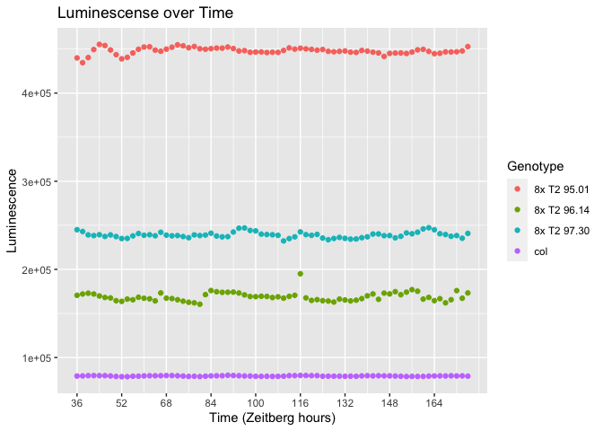
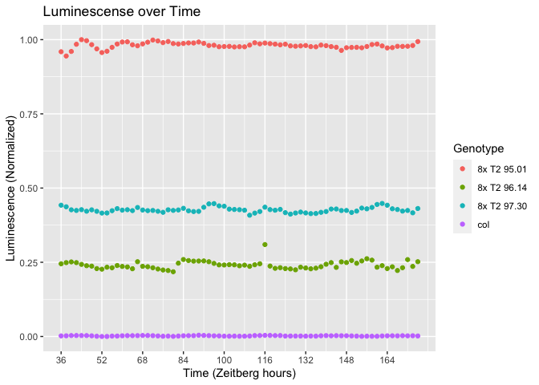

```r
library(tidyverse)
```

```
## Warning: package 'tidyverse' was built under R version 3.5.2
```

```
## ── Attaching packages ───────────────────────────────────────────────────────────────────── tidyverse 1.3.0 ──
```

```
## ✔ ggplot2 3.3.0     ✔ purrr   0.3.3
## ✔ tibble  2.1.3     ✔ dplyr   0.8.5
## ✔ tidyr   1.0.2     ✔ stringr 1.4.0
## ✔ readr   1.3.1     ✔ forcats 0.4.0
```

```
## Warning: package 'ggplot2' was built under R version 3.5.2
```

```
## Warning: package 'tibble' was built under R version 3.5.2
```

```
## Warning: package 'tidyr' was built under R version 3.5.2
```

```
## Warning: package 'purrr' was built under R version 3.5.2
```

```
## Warning: package 'dplyr' was built under R version 3.5.2
```

```
## Warning: package 'stringr' was built under R version 3.5.2
```

```
## Warning: package 'forcats' was built under R version 3.5.2
```

```
## ── Conflicts ──────────────────────────────────────────────────────────────────────── tidyverse_conflicts() ──
## ✖ dplyr::filter() masks stats::filter()
## ✖ dplyr::lag()    masks stats::lag()
```

# 4.9

```r
 DietWeigthLoss <- read.delim("~/Downloads/DietWeigthLoss.txt")
```

```r
boxplot(DietWeigthLoss$WeightLoss~DietWeigthLoss$Diet)
```

<!-- -->

## Ho: Mean weight loss is the same for all diets

```r
aov(formula = DietWeigthLoss$WeightLoss~DietWeigthLoss$Diet)
```

```
## Call:
##    aov(formula = DietWeigthLoss$WeightLoss ~ DietWeigthLoss$Diet)
## 
## Terms:
##                 DietWeigthLoss$Diet Residuals
## Sum of Squares             97.32983 296.98667
## Deg. of Freedom                   3        56
## 
## Residual standard error: 2.302897
## Estimated effects may be unbalanced
```

```r
ANOVA1 = aov(formula = DietWeigthLoss$WeightLoss~DietWeigthLoss$Diet)
```

```r
summary(ANOVA1)
```

```
##                     Df Sum Sq Mean Sq F value  Pr(>F)   
## DietWeigthLoss$Diet  3  97.33   32.44   6.118 0.00113 **
## Residuals           56 296.99    5.30                   
## ---
## Signif. codes:  0 '***' 0.001 '**' 0.01 '*' 0.05 '.' 0.1 ' ' 1
```

```r
attributes(ANOVA1)
```

```
## $names
##  [1] "coefficients"  "residuals"     "effects"       "rank"         
##  [5] "fitted.values" "assign"        "qr"            "df.residual"  
##  [9] "contrasts"     "xlevels"       "call"          "terms"        
## [13] "model"        
## 
## $class
## [1] "aov" "lm"
```

```r
ANOVA1$coefficients
```

```
##          (Intercept) DietWeigthLoss$DietB DietWeigthLoss$DietC 
##            9.1800000           -0.2733333            2.9333333 
## DietWeigthLoss$DietD 
##            1.3600000
```

```r
TukeyHSD(ANOVA1)
```

```
##   Tukey multiple comparisons of means
##     95% family-wise confidence level
## 
## Fit: aov(formula = DietWeigthLoss$WeightLoss ~ DietWeigthLoss$Diet)
## 
## $`DietWeigthLoss$Diet`
##           diff        lwr       upr     p adj
## B-A -0.2733333 -2.4999391 1.9532725 0.9880087
## C-A  2.9333333  0.7067275 5.1599391 0.0051336
## D-A  1.3600000 -0.8666058 3.5866058 0.3773706
## C-B  3.2066667  0.9800609 5.4332725 0.0019015
## D-B  1.6333333 -0.5932725 3.8599391 0.2224287
## D-C -1.5733333 -3.7999391 0.6532725 0.2521236
```

```r
plot(TukeyHSD(ANOVA1), las = 1)
```

<!-- -->

```r
kruskal.test(DietWeigthLoss$WeightLoss~DietWeigthLoss$Diet)
```

```
## 
## 	Kruskal-Wallis rank sum test
## 
## data:  DietWeigthLoss$WeightLoss by DietWeigthLoss$Diet
## Kruskal-Wallis chi-squared = 15.902, df = 3, p-value = 0.001188
```

# 4.10

```r
LungCapData <- read.delim("~/Downloads/LungCapData.txt")
```

```r
tab = table(LungCapData$Gender, LungCapData$Smoke)
```

```r
barplot(tab, beside=T, legend=T)
```

<!-- -->

```r
chisq.test(tab, correct=T)
```

```
## 
## 	Pearson's Chi-squared test with Yates' continuity correction
## 
## data:  tab
## X-squared = 1.7443, df = 1, p-value = 0.1866
```

```r
chi = chisq.test(tab, correct=T)
```

```r
attributes(chi)
```

```
## $names
## [1] "statistic" "parameter" "p.value"   "method"    "data.name" "observed" 
## [7] "expected"  "residuals" "stdres"   
## 
## $class
## [1] "htest"
```

```r
chi$expected
```

```
##         
##                no      yes
##   female 319.9779 38.02207
##   male   328.0221 38.97793
```

```r
fisher.test(tab, conf.int=T, conf.level=0.99)
```

```
## 
## 	Fisher's Exact Test for Count Data
## 
## data:  tab
## p-value = 0.1845
## alternative hypothesis: true odds ratio is not equal to 1
## 99 percent confidence interval:
##  0.3625381 1.3521266
## sample estimates:
## odds ratio 
##  0.7054345
```

# Luminescence Vs. Time plot

```r
Dull.560_All_Results <- read_csv("~/Downloads/Dull 560_All_Results.csv")
```

```
## Parsed with column specification:
## cols(
##   .default = col_double(),
##   Genotype = col_character(),
##   `12` = col_logical(),
##   `14` = col_logical(),
##   `16` = col_logical(),
##   `18` = col_logical(),
##   `20` = col_logical(),
##   `22` = col_logical(),
##   `24` = col_logical(),
##   `26` = col_logical(),
##   `28` = col_logical(),
##   `30` = col_logical(),
##   `32` = col_logical(),
##   `34` = col_logical()
## )
```

```
## See spec(...) for full column specifications.
```

```r
Dull_data <- gather(Dull.560_All_Results, "12":"176", key = "Time", value = "Luminescence")
Dull_data$Time<- as.integer(Dull_data$Time)
dull_data <- filter(Dull_data, Time > 35)
head(dull_data)
```

```
## # A tibble: 6 x 8
##   Region Genotype Period Amplitude  Phase   RAE  Time Luminescence
##    <dbl> <chr>     <dbl>     <dbl>  <dbl> <dbl> <int>        <dbl>
## 1    119 col        25.5     1087   10.4   0.23    36       67713.
## 2    325 col        25.7      748.  11.5   0.23    36       66402.
## 3    167 col        25.8     1355    9.56  0.25    36       90814.
## 4     73 col        24.1     1853    7.49  0.27    36      112052.
## 5    320 col        24.3     1224    9.2   0.28    36       89739.
## 6     71 col        26.0      896. -12.7   0.31    36       98887.
```

```r
d_data <- group_by(dull_data, Genotype) %>% 
  group_by(Time, add = T) %>%
  summarize(Luminescence = mean(Luminescence)) 
```

```r
ggplot(d_data, aes(Time, Luminescence, color = Genotype))+
  geom_point()+
  labs(title = "Luminescense over Time",
      x = "Time (Zeitberg hours)",
       y = "Luminescence")+
  scale_x_continuous(breaks = seq(36,176, 16))
```

<!-- -->

```r
d_data$Luminescence = (d_data$Luminescence - min(d_data$Luminescence))/(max(d_data$Luminescence)
-min(d_data$Luminescence))
```

```r
ggplot(d_data, aes(Time, Luminescence, color = Genotype))+
  geom_point()+
  labs(title = "Luminescense over Time",
      x = "Time (Zeitberg hours)",
       y = "Luminescence (Normalized)")+
  scale_x_continuous(breaks = seq(36,176, 16))
```

<!-- -->


