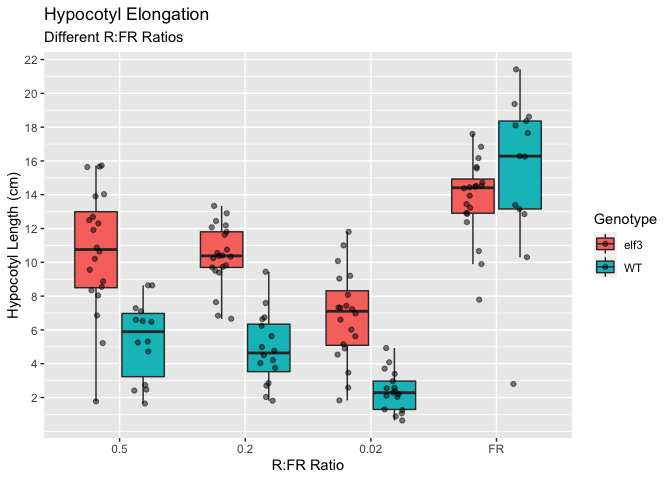
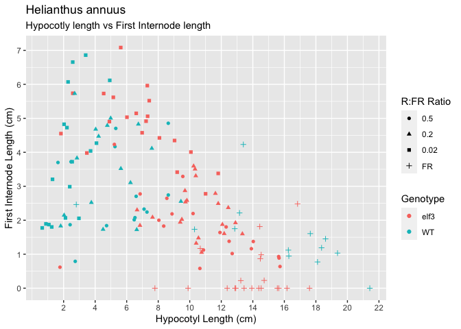
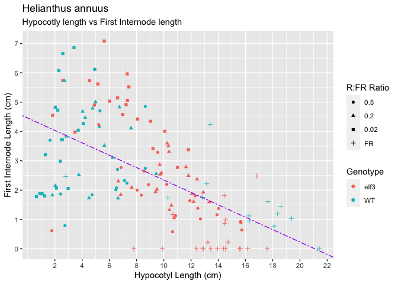
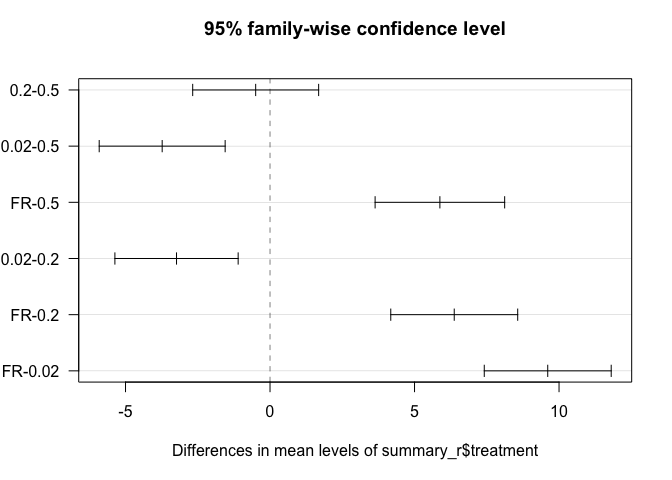
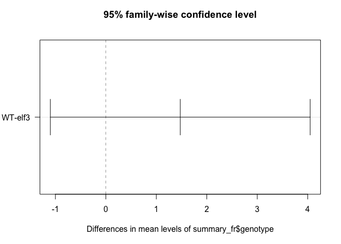
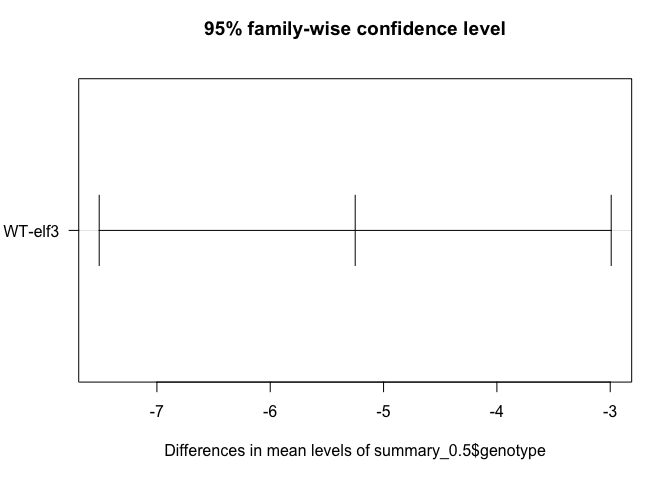
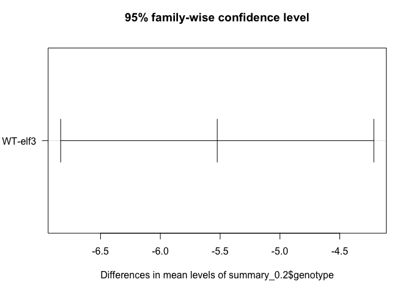
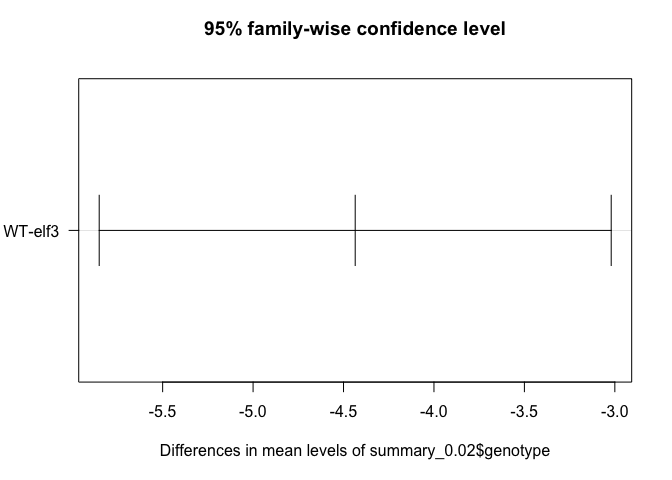
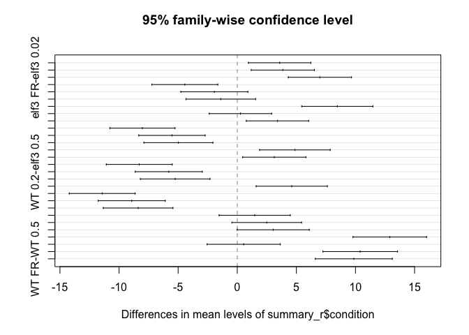

```r
library(tidyverse)
```

```
## Warning: package 'tidyverse' was built under R version 3.5.2
```

```
## ── Attaching packages ──────────────────────────────────────────────────────────── tidyverse 1.3.0 ──
```

```
## ✔ ggplot2 3.3.0     ✔ purrr   0.3.3
## ✔ tibble  2.1.3     ✔ dplyr   0.8.5
## ✔ tidyr   1.0.2     ✔ stringr 1.4.0
## ✔ readr   1.3.1     ✔ forcats 0.4.0
```

```
## Warning: package 'ggplot2' was built under R version 3.5.2
```

```
## Warning: package 'tibble' was built under R version 3.5.2
```

```
## Warning: package 'tidyr' was built under R version 3.5.2
```

```
## Warning: package 'purrr' was built under R version 3.5.2
```

```
## Warning: package 'dplyr' was built under R version 3.5.2
```

```
## Warning: package 'stringr' was built under R version 3.5.2
```

```
## Warning: package 'forcats' was built under R version 3.5.2
```

```
## ── Conflicts ─────────────────────────────────────────────────────────────── tidyverse_conflicts() ──
## ✖ dplyr::filter() masks stats::filter()
## ✖ dplyr::lag()    masks stats::lag()
```

```r
summary <- read.csv("~/Downloads/hypocotyl_elongation_data_rclub.csv")
```


```r
summary(summary)
```

```
##      number       genotype  treatment      DAG     hypocotyl_length 
##  Min.   :  1.00       :48       :48   Min.   :10   Min.   : 0.2836  
##  1st Qu.: 37.75   elf3:82   0.02:39   1st Qu.:10   1st Qu.: 4.0723  
##  Median : 74.50   WT  :66   0.2 :39   Median :10   Median : 8.0600  
##  Mean   : 74.50             0.5 :36   Mean   :10   Mean   : 8.3922  
##  3rd Qu.:111.25             FR  :34   3rd Qu.:10   3rd Qu.:12.3922  
##  Max.   :148.00                       Max.   :10   Max.   :21.4196  
##  NA's   :48                           NA's   :48   NA's   :48       
##  hypcotyl_pixels     cm_pixels     first_internode_length
##  Min.   :  55.59   Min.   :128.0   Min.   :0.000         
##  1st Qu.: 805.22   1st Qu.:172.0   1st Qu.:1.123         
##  Median :1587.22   Median :187.5   Median :2.082         
##  Mean   :1520.82   Mean   :189.8   Mean   :2.481         
##  3rd Qu.:2236.67   3rd Qu.:208.3   3rd Qu.:3.868         
##  Max.   :3180.85   Max.   :246.1   Max.   :7.084         
##  NA's   :48        NA's   :48      NA's   :48            
##  first_internode_pixels        germination_notes    image.used 
##  Min.   :   0.0                         : 48             : 48  
##  1st Qu.: 193.5         good            :141     IMG_1515:  3  
##  Median : 429.0         poor_germination:  7     IMG_1517:  3  
##  Mean   : 474.0                                  IMG_1519:  3  
##  3rd Qu.: 706.8                                  IMG_1522:  3  
##  Max.   :1353.0                                  IMG_1524:  3  
##  NA's   :48                                      (Other) :133  
##     X          
##  Mode:logical  
##  NA's:196      
##                
##                
##                
##                
## 
```


```r
summary_r <- filter(summary,  germination_notes == "good")
summary_r
```

```
##     number genotype treatment DAG hypocotyl_length hypcotyl_pixels
## 1        2       WT        FR  10       13.3989932        2358.263
## 2        3       WT        FR  10       21.4196183        2955.993
## 3        4       WT        FR  10       18.3603156        2533.797
## 4        5       WT        FR  10       19.3723682        3180.846
## 5        6       WT        FR  10        2.8037273         460.358
## 6        7       WT        FR  10       18.1041429        2914.767
## 7        8       WT        FR  10       17.6447205        2840.800
## 8        9       WT        FR  10       12.8536129        2198.302
## 9       10       WT        FR  10       16.2849625        2785.152
## 10      11       WT        FR  10       18.6132885        2978.182
## 11      12       WT        FR  10       13.1584783        2105.396
## 12      13       WT        FR  10       16.2533892        2714.316
## 13      14       WT        FR  10       10.3034072        1720.669
## 14      15     elf3        FR  10       10.6673931        1365.597
## 15      16     elf3        FR  10       14.5278246        1859.794
## 16      17     elf3        FR  10       12.9207677        1654.065
## 17      18     elf3        FR  10       13.9406039        2078.321
## 18      19     elf3        FR  10       17.5952818        2623.175
## 19      20     elf3        FR  10       16.8374943        2510.201
## 20      21     elf3        FR  10       14.4406913        2353.876
## 21      22     elf3        FR  10       14.4755986        2359.566
## 22      23     elf3        FR  10       12.8690576        2097.695
## 23      24     elf3        FR  10       14.7194488        2532.437
## 24      25     elf3        FR  10       13.2373247        2277.442
## 25      26     elf3        FR  10        9.8945695        1702.331
## 26      27     elf3        FR  10       12.3754217        2054.320
## 27      28     elf3        FR  10       15.5552590        2582.173
## 28      29     elf3        FR  10       15.6459157        2597.222
## 29      30     elf3        FR  10       16.1675260        2489.799
## 30      31     elf3        FR  10        7.7891818        1199.534
## 31      32     elf3        FR  10       14.5305195        2237.700
## 32      33     elf3        FR  10       13.4458333        2608.532
## 33      34     elf3        FR  10       14.3799684        2789.757
## 34      35       WT      0.02  10        3.4000163         625.603
## 35      36       WT      0.02  10        2.0295707         373.441
## 36      37       WT      0.02  10        1.2955000         238.372
## 37      38       WT      0.02  10        3.7110857         765.571
## 38      39       WT      0.02  10        0.8794676         181.428
## 39      40       WT      0.02  10        2.2842074         471.216
## 40      41       WT      0.02  10        2.2118811         449.671
## 41      42       WT      0.02  10        2.5790023         524.306
## 42      43       WT      0.02  10        0.6421460         130.547
## 43      45       WT      0.02  10        4.9261604         921.192
## 44      46       WT      0.02  10        2.3891230         446.766
## 45      48       WT      0.02  10        4.0847418         870.050
## 46      49       WT      0.02  10        2.5429859         541.656
## 47      50       WT      0.02  10        2.9716105         687.702
## 48      51       WT      0.02  10        2.1159690         489.686
## 49      52       WT      0.02  10        1.0650451         246.477
## 50      53       WT      0.02  10        1.2469831         294.288
## 51      54     elf3      0.02  10        6.0171158         776.581
## 52      55     elf3      0.02  10        8.0777533        1042.531
## 53      56     elf3      0.02  10        7.3087043         943.276
## 54      57     elf3      0.02  10        2.5833758         379.764
## 55      58     elf3      0.02  10       11.0050271        1617.772
## 56      59     elf3      0.02  10       10.0746992        1481.011
## 57      60     elf3      0.02  10        6.9795612        1032.996
## 58      61     elf3      0.02  10        7.4298967        1099.647
## 59      62     elf3      0.02  10        7.3285812        1084.652
## 60      63     elf3      0.02  10        5.1524245         908.290
## 61      64     elf3      0.02  10        9.0365093        1592.992
## 62      65     elf3      0.02  10        1.8306199         322.709
## 63      66     elf3      0.02  10        4.5415937         814.771
## 64      67     elf3      0.02  10        5.6237556        1008.913
## 65      68     elf3      0.02  10        4.9027213         879.558
## 66      69     elf3      0.02  10        9.2033351        1702.617
## 67      70     elf3      0.02  10        6.6053568        1221.991
## 68      71     elf3      0.02  10        7.2296216        1337.480
## 69      72     elf3      0.02  10       11.8054712        2254.845
## 70      73     elf3      0.02  10        3.4728534         663.315
## 71      74       WT       0.2  10        6.2417826        1167.282
## 72      75       WT       0.2  10        4.7698959         892.023
## 73      76       WT       0.2  10        4.5027672         842.067
## 74      77       WT       0.2  10        5.6313323        1037.145
## 75      78       WT       0.2  10        3.7592005         692.347
## 76      79       WT       0.2  10        6.7405443        1241.433
## 77      80       WT       0.2  10        2.0324565         402.841
## 78      81       WT       0.2  10        9.4412020        1871.284
## 79      83       WT       0.2  10        1.8149510         375.713
## 80      84       WT       0.2  10        7.5942225        1572.080
## 81      85       WT       0.2  10        4.0350756         835.301
## 82      86       WT       0.2  10        2.8471418         643.511
## 83      87       WT       0.2  10        4.9849128        1126.690
## 84      88       WT       0.2  10        2.7032962         610.999
## 85      89       WT       0.2  10        4.2196197        1038.575
## 86      90       WT       0.2  10        6.6379027        1633.787
## 87      92     elf3       0.2  10       10.7522003        2021.876
## 88      93     elf3       0.2  10        9.8204985        1846.676
## 89      94     elf3       0.2  10        9.3947129        1766.610
## 90      95     elf3       0.2  10        9.4993122        1719.480
## 91      96     elf3       0.2  10       13.3384546        2414.407
## 92      97     elf3       0.2  10        9.6983332        1755.505
## 93      98     elf3       0.2  10       11.8056157        2207.780
## 94      99     elf3       0.2  10       12.4424660        2326.878
## 95     100     elf3       0.2  10       12.1838341        2278.511
## 96     101     elf3       0.2  10       10.4069580        1998.240
## 97     102     elf3       0.2  10       10.3833186        1993.701
## 98     103     elf3       0.2  10       12.0698922        2317.540
## 99     104     elf3       0.2  10       11.6273164        2118.218
## 100    105     elf3       0.2  10       10.2460533        1866.585
## 101    106     elf3       0.2  10        6.8419825        1246.445
## 102    107     elf3       0.2  10        9.7293283        1926.407
## 103    108     elf3       0.2  10       12.9000455        2554.209
## 104    109     elf3       0.2  10       10.3359798        2046.524
## 105    110     elf3       0.2  10       10.5514903        2184.264
## 106    111     elf3       0.2  10        7.6395150        1581.456
## 107    112     elf3       0.2  10        6.6592483        1378.531
## 108    113       WT       0.5  10        6.5258208        1383.722
## 109    114       WT       0.5  10        8.6376310        1831.506
## 110    115       WT       0.5  10        5.3089965        1125.709
## 111    116       WT       0.5  10        8.6391066        1988.515
## 112    117       WT       0.5  10        2.4693582         568.387
## 113    118       WT       0.5  10        6.4774477        1490.953
## 114    119       WT       0.5  10        4.7247941        1054.489
## 115    120       WT       0.5  10        2.7370263         610.855
## 116    121       WT       0.5  10        7.2866898        1626.258
## 117    122       WT       0.5  10        5.2581976        1269.066
## 118    123       WT       0.5  10        2.4115434         582.026
## 119    124       WT       0.5  10        1.6420965         396.320
## 120    126       WT       0.5  10        7.1020667        1655.023
## 121    127       WT       0.5  10        6.5994233        1537.890
## 122    129     elf3       0.5  10        8.5473929        1675.289
## 123    130     elf3       0.5  10        9.5608929        1873.935
## 124    131     elf3       0.5  10       10.8715661        2479.315
## 125    132     elf3       0.5  10       12.3087194        2807.065
## 126    133     elf3       0.5  10        8.3486790        1903.958
## 127    134     elf3       0.5  10       13.9081529        2949.349
## 128    135     elf3       0.5  10        8.0422995        1705.442
## 129    136     elf3       0.5  10        6.8532012        1453.283
## 130    137     elf3       0.5  10       12.4974847        2538.964
## 131    138     elf3       0.5  10       15.6395859        3177.307
## 132    139     elf3       0.5  10        5.2193662        1060.356
## 133    140     elf3       0.5  10       15.7244397        2783.273
## 134    141     elf3       0.5  10       11.9167867        2109.307
## 135    142     elf3       0.5  10        8.8768213        1571.224
## 136    143     elf3       0.5  10       10.6425398        2331.110
## 137    144     elf3       0.5  10       10.2098230        2236.329
## 138    145     elf3       0.5  10        1.7695640         387.600
## 139    146     elf3       0.5  10       12.6913325        2425.669
## 140    147     elf3       0.5  10       15.6622473        2993.494
## 141    148     elf3       0.5  10       14.0294096        2681.413
##     cm_pixels first_internode_length first_internode_pixels
## 1     176.003              4.2308256                744.638
## 2     138.004              0.0000000                  0.000
## 3     138.004              1.1887047                164.046
## 4     164.195              1.0332897                169.661
## 5     164.195              2.4634124                404.480
## 6     161.000              0.7728075                124.422
## 7     161.000              1.6063602                258.624
## 8     171.026              1.7510262                299.471
## 9     171.026              0.9454527                161.697
## 10    160.003              1.4522978                232.372
## 11    160.003              2.2149147                354.393
## 12    167.000              1.1205389                187.130
## 13    167.000              1.7328623                289.388
## 14    128.016              1.1685805                149.597
## 15    128.016              0.0000000                  0.000
## 16    128.016              0.0000000                  0.000
## 17    149.084              0.0000000                  0.000
## 18    149.084              0.0000000                  0.000
## 19    149.084              2.4823522                370.079
## 20    163.003              1.8132366                295.563
## 21    163.003              0.8686405                141.591
## 22    163.003              0.0000000                  0.000
## 23    172.047              0.2283620                 39.289
## 24    172.047              0.2232471                 38.409
## 25    172.047              0.0000000                  0.000
## 26    166.000              0.0000000                  0.000
## 27    166.000              0.0000000                  0.000
## 28    166.000              0.0000000                  0.000
## 29    154.000              0.0000000                  0.000
## 30    154.000              0.0000000                  0.000
## 31    154.000              0.9847987                151.659
## 32    194.003              0.0000000                  0.000
## 33    194.003              0.0000000                  0.000
## 34    184.000              6.8604348               1262.320
## 35    184.000              4.8254946                887.891
## 36    184.000              3.2048207                589.687
## 37    206.293              4.0398220                833.387
## 38    206.293              1.8928660                390.485
## 39    206.293              6.0712870               1252.464
## 40    203.298              4.7266033                960.909
## 41    203.298              6.6554614               1353.042
## 42    203.298              1.7739574                360.642
## 43    187.000              6.1177112               1144.012
## 44    187.000              2.9880107                558.758
## 45    213.000              4.2695070                909.405
## 46    213.000              3.7221361                792.815
## 47    231.424              2.0567659                475.985
## 48    231.424              2.0676291                478.499
## 49    231.424              1.8727574                433.401
## 50    236.000              1.8024619                425.381
## 51    129.062              5.0333251                649.611
## 52    129.062              4.4238970                570.957
## 53    129.062              5.9629480                769.590
## 54    147.003              5.7374884                843.428
## 55    147.003              2.7783855                408.431
## 56    147.003              4.0070883                589.054
## 57    148.003              4.5745627                677.049
## 58    148.003              5.5194354                816.893
## 59    148.003              5.0598974                748.880
## 60    176.284              5.6185927                990.468
## 61    176.284              4.3465601                766.229
## 62    176.284              4.5505831                802.195
## 63    179.402              5.7301591               1028.002
## 64    179.402              7.0835275               1270.799
## 65    179.402              4.9035964                879.715
## 66    185.000              3.4152649                631.824
## 67    185.000              5.1467892                952.156
## 68    185.000              4.9161514                909.488
## 69    191.000              3.3787801                645.347
## 70    191.000              3.9794031                760.066
## 71    187.011              3.1058975                580.837
## 72    187.011              4.7897183                895.730
## 73    187.011              1.7314864                323.807
## 74    184.174              3.5203503                648.357
## 75    184.174              2.5216154                464.416
## 76    184.174              4.8279616                889.185
## 77    198.204              2.1485893                425.859
## 78    198.204              2.5541109                506.235
## 79    207.010              1.8301580                378.861
## 80    207.010              4.1160475                852.063
## 81    207.010              4.6782040                968.435
## 82    226.020              3.8307008                865.815
## 83    226.020              5.0044288               1131.101
## 84    226.020              5.7304708               1295.201
## 85    246.130              4.4713850               1100.542
## 86    246.130              1.7228375                424.042
## 87    188.043              1.0526422                197.942
## 88    188.043              2.5828188                485.681
## 89    188.043              1.9413751                365.062
## 90    181.011              2.0256448                366.664
## 91    181.011              1.5990188                289.440
## 92    181.011              2.8702068                519.539
## 93    187.011              2.4914470                465.928
## 94    187.011              2.3706573                443.339
## 95    187.011              1.6060713                300.353
## 96    192.010              1.3226499                253.962
## 97    192.010              3.3071871                635.013
## 98    192.010              1.8756627                360.146
## 99    182.176              2.7884628                507.991
## 100   182.176              3.5944032                654.814
## 101   182.176              1.8472905                336.532
## 102   198.000              2.5369949                502.325
## 103   198.000              1.9250606                381.162
## 104   198.000              3.5056768                694.124
## 105   207.010              1.4775035                305.858
## 106   207.010              2.0875513                432.144
## 107   207.010              2.3032945                476.805
## 108   212.038              2.0763825                440.272
## 109   212.038              4.8544318               1029.324
## 110   212.038              4.7033362                997.286
## 111   230.176              2.7431748                631.413
## 112   230.176              3.7218520                856.681
## 113   230.176              2.0136157                463.486
## 114   223.182              1.8408205                410.838
## 115   223.182              0.7900234                176.319
## 116   223.182              2.2413367                500.226
## 117   241.350              4.1674332               1005.810
## 118   241.350              1.8681748                450.884
## 119   241.350              3.6999959                892.994
## 120   233.034              2.3275187                542.391
## 121   233.034              2.7039745                630.118
## 122   196.000              2.6458112                518.579
## 123   196.000              3.2894541                644.733
## 124   228.055              1.1237772                256.283
## 125   228.055              1.8029949                411.182
## 126   228.055              1.8282300                416.937
## 127   212.059              1.1619125                246.394
## 128   212.059              2.0006696                424.260
## 129   212.059              2.7745816                588.375
## 130   203.158              1.3805560                280.471
## 131   203.158              0.9318215                189.307
## 132   203.158              4.2316768                859.699
## 133   177.003              0.6380344                112.934
## 134   177.003              1.6394016                290.179
## 135   177.003              2.1866353                387.041
## 136   219.037              0.5815547                127.382
## 137   219.037              2.1970306                481.231
## 138   219.037              0.6179002                135.343
## 139   191.128              1.0197093                194.895
## 140   191.128              0.8870129                169.533
## 141   191.128              1.3743878                262.684
##     germination_notes image.used  X
## 1                good   IMG_1529 NA
## 2                good   IMG_1532 NA
## 3                good   IMG_1532 NA
## 4                good   IMG_1534 NA
## 5                good   IMG_1534 NA
## 6                good   IMG_1536 NA
## 7                good   IMG_1536 NA
## 8                good   IMG_1538 NA
## 9                good   IMG_1538 NA
## 10               good   IMG_1539 NA
## 11               good   IMG_1539 NA
## 12               good   IMG_1543 NA
## 13               good   IMG_1543 NA
## 14               good   IMG_1515 NA
## 15               good   IMG_1515 NA
## 16               good   IMG_1515 NA
## 17               good   IMG_1517 NA
## 18               good   IMG_1517 NA
## 19               good   IMG_1517 NA
## 20               good   IMG_1519 NA
## 21               good   IMG_1519 NA
## 22               good   IMG_1519 NA
## 23               good   IMG_1522 NA
## 24               good   IMG_1522 NA
## 25               good   IMG_1522 NA
## 26               good   IMG_1524 NA
## 27               good   IMG_1524 NA
## 28               good   IMG_1524 NA
## 29               good   IMG_1526 NA
## 30               good   IMG_1526 NA
## 31               good   IMG_1526 NA
## 32               good   IMG_1528 NA
## 33               good   IMG_1528 NA
## 34               good   IMG_1722 NA
## 35               good   IMG_1722 NA
## 36               good   IMG_1722 NA
## 37               good   IMG_1724 NA
## 38               good   IMG_1724 NA
## 39               good   IMG_1724 NA
## 40               good   IMG_1725 NA
## 41               good   IMG_1725 NA
## 42               good   IMG_1725 NA
## 43               good   IMG_1726 NA
## 44               good   IMG_1726 NA
## 45               good   IMG_1727 NA
## 46               good   IMG_1727 NA
## 47               good   IMG_1728 NA
## 48               good   IMG_1728 NA
## 49               good   IMG_1728 NA
## 50               good   IMG_1729 NA
## 51               good   IMG_1710 NA
## 52               good   IMG_1710 NA
## 53               good   IMG_1710 NA
## 54               good   IMG_1711 NA
## 55               good   IMG_1711 NA
## 56               good   IMG_1711 NA
## 57               good   IMG_1713 NA
## 58               good   IMG_1713 NA
## 59               good   IMG_1713 NA
## 60               good   IMG_1714 NA
## 61               good   IMG_1714 NA
## 62               good   IMG_1714 NA
## 63               good   IMG_1715 NA
## 64               good   IMG_1715 NA
## 65               good   IMG_1715 NA
## 66               good   IMG_1717 NA
## 67               good   IMG_1717 NA
## 68               good   IMG_1717 NA
## 69               good   IMG_1719 NA
## 70               good   IMG_1719 NA
## 71               good   IMG_1888 NA
## 72               good   IMG_1888 NA
## 73               good   IMG_1888 NA
## 74               good   IMG_1889 NA
## 75               good   IMG_1889 NA
## 76               good   IMG_1889 NA
## 77               good   IMG_1890 NA
## 78               good   IMG_1890 NA
## 79               good   IMG_1891 NA
## 80               good   IMG_1891 NA
## 81               good   IMG_1891 NA
## 82               good   IMG_1892 NA
## 83               good   IMG_1892 NA
## 84               good   IMG_1892 NA
## 85               good   IMG_1893 NA
## 86               good   IMG_1893 NA
## 87               good   IMG_1880 NA
## 88               good   IMG_1880 NA
## 89               good   IMG_1880 NA
## 90               good   IMG_1881 NA
## 91               good   IMG_1881 NA
## 92               good   IMG_1881 NA
## 93               good   IMG_1882 NA
## 94               good   IMG_1882 NA
## 95               good   IMG_1882 NA
## 96               good   IMG_1883 NA
## 97               good   IMG_1883 NA
## 98               good   IMG_1883 NA
## 99               good   IMG_1884 NA
## 100              good   IMG_1884 NA
## 101              good   IMG_1884 NA
## 102              good   IMG_1885 NA
## 103              good   IMG_1885 NA
## 104              good   IMG_1885 NA
## 105              good   IMG_1886 NA
## 106              good   IMG_1886 NA
## 107              good   IMG_1886 NA
## 108              good   IMG_1953 NA
## 109              good   IMG_1953 NA
## 110              good   IMG_1953 NA
## 111              good   IMG_1954 NA
## 112              good   IMG_1954 NA
## 113              good   IMG_1954 NA
## 114              good   IMG_1955 NA
## 115              good   IMG_1955 NA
## 116              good   IMG_1955 NA
## 117              good   IMG_1956 NA
## 118              good   IMG_1956 NA
## 119              good   IMG_1956 NA
## 120              good   IMG_1957 NA
## 121              good   IMG_1957 NA
## 122              good   IMG_1945 NA
## 123              good   IMG_1945 NA
## 124              good   IMG_1946 NA
## 125              good   IMG_1946 NA
## 126              good   IMG_1946 NA
## 127              good   IMG_1947 NA
## 128              good   IMG_1947 NA
## 129              good   IMG_1947 NA
## 130              good   IMG_1948 NA
## 131              good   IMG_1948 NA
## 132              good   IMG_1948 NA
## 133              good   IMG_1949 NA
## 134              good   IMG_1949 NA
## 135              good   IMG_1949 NA
## 136              good   IMG_1950 NA
## 137              good   IMG_1950 NA
## 138              good   IMG_1950 NA
## 139              good   IMG_1951 NA
## 140              good   IMG_1951 NA
## 141              good   IMG_1951 NA
```


```r
summary_r$treatment = factor(summary_r$treatment, levels = c("0.5", "0.2", "0.02", "FR"))
ggplot(summary_r, aes(treatment, hypocotyl_length, fill = genotype)) + 
  geom_boxplot(outlier.size = -1) + 
  geom_point(alpha = 0.5, position = position_jitterdodge()) +
  labs(title = "Hypocotyl Elongation",
       subtitle = "Different R:FR Ratios",
       x = "R:FR Ratio",
       y = "Hypocotyl Length (cm)",
       fill = "Genotype") +
  scale_y_continuous(breaks = c(2, 4, 6, 8, 10, 12, 14, 16, 18, 20, 22))
```

<!-- -->


```r
ggplot(summary_r, aes(hypocotyl_length, first_internode_length, fill)) + 
  geom_point(aes(color = genotype, shape = treatment))+
  labs(title = "Helianthus annuus",
       subtitle = "Hypocotly length vs First Internode length",
       x = "Hypocotyl Length (cm)",
       y = "First Internode Length (cm)",
       color = "Genotype",
       shape = "R:FR Ratio") +
  scale_x_continuous(breaks = c(2, 4, 6, 8, 10, 12, 14, 16, 18, 20, 22))+
  scale_y_continuous(breaks = c(0, 1, 2, 3, 4, 5, 6, 7, 8))
```

<!-- -->


```r
lm_hypocotyl <- lm(summary_r$first_internode_length~summary_r$hypocotyl_length)
lm_hypocotyl
```

```
## 
## Call:
## lm(formula = summary_r$first_internode_length ~ summary_r$hypocotyl_length)
## 
## Coefficients:
##                (Intercept)  summary_r$hypocotyl_length  
##                     4.4577                     -0.2114
```

```r
?geom_abline
```


```r
ggplot(summary_r, aes(hypocotyl_length, first_internode_length, fill)) + 
  geom_point(aes(color = genotype, shape = treatment))+
  geom_abline(slope= -0.2114, intercept = 4.4577, color = "purple", linetype = 6 )+
  labs(title = "Helianthus annuus",
       subtitle = "Hypocotly length vs First Internode length",
       x = "Hypocotyl Length (cm)",
       y = "First Internode Length (cm)",
       color = "Genotype",
       shape = "R:FR Ratio") +
  scale_x_continuous(breaks = c(2, 4, 6, 8, 10, 12, 14, 16, 18, 20, 22))+
  scale_y_continuous(breaks = c(0, 1, 2, 3, 4, 5, 6, 7, 8))
```

<!-- -->

```r
anova_treatment <- aov(formula = summary_r$hypocotyl_length~summary_r$treatment)
anova_treatment
```

```
## Call:
##    aov(formula = summary_r$hypocotyl_length ~ summary_r$treatment)
## 
## Terms:
##                 summary_r$treatment Residuals
## Sum of Squares             1654.255  1703.685
## Deg. of Freedom                   3       137
## 
## Residual standard error: 3.526423
## Estimated effects may be unbalanced
```

```r
TukeyHSD(anova_treatment)
```

```
##   Tukey multiple comparisons of means
##     95% family-wise confidence level
## 
## Fit: aov(formula = summary_r$hypocotyl_length ~ summary_r$treatment)
## 
## $`summary_r$treatment`
##                diff       lwr       upr     p adj
## 0.2-0.5  -0.4964876 -2.675389  1.682414 0.9341606
## 0.02-0.5 -3.7315791 -5.910480 -1.552678 0.0001013
## FR-0.5    5.8772829  3.636036  8.118530 0.0000000
## 0.02-0.2 -3.2350915 -5.367463 -1.102720 0.0007235
## FR-0.2    6.3737705  4.177732  8.569809 0.0000000
## FR-0.02   9.6088620  7.412824 11.804900 0.0000000
```

```r
plot(TukeyHSD(anova_treatment), las=1)
```

<!-- -->

```r
summary_fr <- filter(summary_r, treatment == "FR")
summary_fr
```

```
##    number genotype treatment DAG hypocotyl_length hypcotyl_pixels
## 1       2       WT        FR  10        13.398993        2358.263
## 2       3       WT        FR  10        21.419618        2955.993
## 3       4       WT        FR  10        18.360316        2533.797
## 4       5       WT        FR  10        19.372368        3180.846
## 5       6       WT        FR  10         2.803727         460.358
## 6       7       WT        FR  10        18.104143        2914.767
## 7       8       WT        FR  10        17.644720        2840.800
## 8       9       WT        FR  10        12.853613        2198.302
## 9      10       WT        FR  10        16.284963        2785.152
## 10     11       WT        FR  10        18.613288        2978.182
## 11     12       WT        FR  10        13.158478        2105.396
## 12     13       WT        FR  10        16.253389        2714.316
## 13     14       WT        FR  10        10.303407        1720.669
## 14     15     elf3        FR  10        10.667393        1365.597
## 15     16     elf3        FR  10        14.527825        1859.794
## 16     17     elf3        FR  10        12.920768        1654.065
## 17     18     elf3        FR  10        13.940604        2078.321
## 18     19     elf3        FR  10        17.595282        2623.175
## 19     20     elf3        FR  10        16.837494        2510.201
## 20     21     elf3        FR  10        14.440691        2353.876
## 21     22     elf3        FR  10        14.475599        2359.566
## 22     23     elf3        FR  10        12.869058        2097.695
## 23     24     elf3        FR  10        14.719449        2532.437
## 24     25     elf3        FR  10        13.237325        2277.442
## 25     26     elf3        FR  10         9.894570        1702.331
## 26     27     elf3        FR  10        12.375422        2054.320
## 27     28     elf3        FR  10        15.555259        2582.173
## 28     29     elf3        FR  10        15.645916        2597.222
## 29     30     elf3        FR  10        16.167526        2489.799
## 30     31     elf3        FR  10         7.789182        1199.534
## 31     32     elf3        FR  10        14.530519        2237.700
## 32     33     elf3        FR  10        13.445833        2608.532
## 33     34     elf3        FR  10        14.379968        2789.757
##    cm_pixels first_internode_length first_internode_pixels
## 1    176.003              4.2308256                744.638
## 2    138.004              0.0000000                  0.000
## 3    138.004              1.1887047                164.046
## 4    164.195              1.0332897                169.661
## 5    164.195              2.4634124                404.480
## 6    161.000              0.7728075                124.422
## 7    161.000              1.6063602                258.624
## 8    171.026              1.7510262                299.471
## 9    171.026              0.9454527                161.697
## 10   160.003              1.4522978                232.372
## 11   160.003              2.2149147                354.393
## 12   167.000              1.1205389                187.130
## 13   167.000              1.7328623                289.388
## 14   128.016              1.1685805                149.597
## 15   128.016              0.0000000                  0.000
## 16   128.016              0.0000000                  0.000
## 17   149.084              0.0000000                  0.000
## 18   149.084              0.0000000                  0.000
## 19   149.084              2.4823522                370.079
## 20   163.003              1.8132366                295.563
## 21   163.003              0.8686405                141.591
## 22   163.003              0.0000000                  0.000
## 23   172.047              0.2283620                 39.289
## 24   172.047              0.2232471                 38.409
## 25   172.047              0.0000000                  0.000
## 26   166.000              0.0000000                  0.000
## 27   166.000              0.0000000                  0.000
## 28   166.000              0.0000000                  0.000
## 29   154.000              0.0000000                  0.000
## 30   154.000              0.0000000                  0.000
## 31   154.000              0.9847987                151.659
## 32   194.003              0.0000000                  0.000
## 33   194.003              0.0000000                  0.000
##    germination_notes image.used  X
## 1               good   IMG_1529 NA
## 2               good   IMG_1532 NA
## 3               good   IMG_1532 NA
## 4               good   IMG_1534 NA
## 5               good   IMG_1534 NA
## 6               good   IMG_1536 NA
## 7               good   IMG_1536 NA
## 8               good   IMG_1538 NA
## 9               good   IMG_1538 NA
## 10              good   IMG_1539 NA
## 11              good   IMG_1539 NA
## 12              good   IMG_1543 NA
## 13              good   IMG_1543 NA
## 14              good   IMG_1515 NA
## 15              good   IMG_1515 NA
## 16              good   IMG_1515 NA
## 17              good   IMG_1517 NA
## 18              good   IMG_1517 NA
## 19              good   IMG_1517 NA
## 20              good   IMG_1519 NA
## 21              good   IMG_1519 NA
## 22              good   IMG_1519 NA
## 23              good   IMG_1522 NA
## 24              good   IMG_1522 NA
## 25              good   IMG_1522 NA
## 26              good   IMG_1524 NA
## 27              good   IMG_1524 NA
## 28              good   IMG_1524 NA
## 29              good   IMG_1526 NA
## 30              good   IMG_1526 NA
## 31              good   IMG_1526 NA
## 32              good   IMG_1528 NA
## 33              good   IMG_1528 NA
```

```r
summary_0.5 <- filter(summary_r, treatment == "0.5")
summary_0.5
```

```
##    number genotype treatment DAG hypocotyl_length hypcotyl_pixels
## 1     113       WT       0.5  10         6.525821        1383.722
## 2     114       WT       0.5  10         8.637631        1831.506
## 3     115       WT       0.5  10         5.308997        1125.709
## 4     116       WT       0.5  10         8.639107        1988.515
## 5     117       WT       0.5  10         2.469358         568.387
## 6     118       WT       0.5  10         6.477448        1490.953
## 7     119       WT       0.5  10         4.724794        1054.489
## 8     120       WT       0.5  10         2.737026         610.855
## 9     121       WT       0.5  10         7.286690        1626.258
## 10    122       WT       0.5  10         5.258198        1269.066
## 11    123       WT       0.5  10         2.411543         582.026
## 12    124       WT       0.5  10         1.642097         396.320
## 13    126       WT       0.5  10         7.102067        1655.023
## 14    127       WT       0.5  10         6.599423        1537.890
## 15    129     elf3       0.5  10         8.547393        1675.289
## 16    130     elf3       0.5  10         9.560893        1873.935
## 17    131     elf3       0.5  10        10.871566        2479.315
## 18    132     elf3       0.5  10        12.308719        2807.065
## 19    133     elf3       0.5  10         8.348679        1903.958
## 20    134     elf3       0.5  10        13.908153        2949.349
## 21    135     elf3       0.5  10         8.042300        1705.442
## 22    136     elf3       0.5  10         6.853201        1453.283
## 23    137     elf3       0.5  10        12.497485        2538.964
## 24    138     elf3       0.5  10        15.639586        3177.307
## 25    139     elf3       0.5  10         5.219366        1060.356
## 26    140     elf3       0.5  10        15.724440        2783.273
## 27    141     elf3       0.5  10        11.916787        2109.307
## 28    142     elf3       0.5  10         8.876821        1571.224
## 29    143     elf3       0.5  10        10.642540        2331.110
## 30    144     elf3       0.5  10        10.209823        2236.329
## 31    145     elf3       0.5  10         1.769564         387.600
## 32    146     elf3       0.5  10        12.691333        2425.669
## 33    147     elf3       0.5  10        15.662247        2993.494
## 34    148     elf3       0.5  10        14.029410        2681.413
##    cm_pixels first_internode_length first_internode_pixels
## 1    212.038              2.0763825                440.272
## 2    212.038              4.8544318               1029.324
## 3    212.038              4.7033362                997.286
## 4    230.176              2.7431748                631.413
## 5    230.176              3.7218520                856.681
## 6    230.176              2.0136157                463.486
## 7    223.182              1.8408205                410.838
## 8    223.182              0.7900234                176.319
## 9    223.182              2.2413367                500.226
## 10   241.350              4.1674332               1005.810
## 11   241.350              1.8681748                450.884
## 12   241.350              3.6999959                892.994
## 13   233.034              2.3275187                542.391
## 14   233.034              2.7039745                630.118
## 15   196.000              2.6458112                518.579
## 16   196.000              3.2894541                644.733
## 17   228.055              1.1237772                256.283
## 18   228.055              1.8029949                411.182
## 19   228.055              1.8282300                416.937
## 20   212.059              1.1619125                246.394
## 21   212.059              2.0006696                424.260
## 22   212.059              2.7745816                588.375
## 23   203.158              1.3805560                280.471
## 24   203.158              0.9318215                189.307
## 25   203.158              4.2316768                859.699
## 26   177.003              0.6380344                112.934
## 27   177.003              1.6394016                290.179
## 28   177.003              2.1866353                387.041
## 29   219.037              0.5815547                127.382
## 30   219.037              2.1970306                481.231
## 31   219.037              0.6179002                135.343
## 32   191.128              1.0197093                194.895
## 33   191.128              0.8870129                169.533
## 34   191.128              1.3743878                262.684
##    germination_notes image.used  X
## 1               good   IMG_1953 NA
## 2               good   IMG_1953 NA
## 3               good   IMG_1953 NA
## 4               good   IMG_1954 NA
## 5               good   IMG_1954 NA
## 6               good   IMG_1954 NA
## 7               good   IMG_1955 NA
## 8               good   IMG_1955 NA
## 9               good   IMG_1955 NA
## 10              good   IMG_1956 NA
## 11              good   IMG_1956 NA
## 12              good   IMG_1956 NA
## 13              good   IMG_1957 NA
## 14              good   IMG_1957 NA
## 15              good   IMG_1945 NA
## 16              good   IMG_1945 NA
## 17              good   IMG_1946 NA
## 18              good   IMG_1946 NA
## 19              good   IMG_1946 NA
## 20              good   IMG_1947 NA
## 21              good   IMG_1947 NA
## 22              good   IMG_1947 NA
## 23              good   IMG_1948 NA
## 24              good   IMG_1948 NA
## 25              good   IMG_1948 NA
## 26              good   IMG_1949 NA
## 27              good   IMG_1949 NA
## 28              good   IMG_1949 NA
## 29              good   IMG_1950 NA
## 30              good   IMG_1950 NA
## 31              good   IMG_1950 NA
## 32              good   IMG_1951 NA
## 33              good   IMG_1951 NA
## 34              good   IMG_1951 NA
```

```r
summary_0.2 <- filter(summary_r, treatment == "0.2")
summary_0.2
```

```
##    number genotype treatment DAG hypocotyl_length hypcotyl_pixels
## 1      74       WT       0.2  10         6.241783        1167.282
## 2      75       WT       0.2  10         4.769896         892.023
## 3      76       WT       0.2  10         4.502767         842.067
## 4      77       WT       0.2  10         5.631332        1037.145
## 5      78       WT       0.2  10         3.759201         692.347
## 6      79       WT       0.2  10         6.740544        1241.433
## 7      80       WT       0.2  10         2.032456         402.841
## 8      81       WT       0.2  10         9.441202        1871.284
## 9      83       WT       0.2  10         1.814951         375.713
## 10     84       WT       0.2  10         7.594223        1572.080
## 11     85       WT       0.2  10         4.035076         835.301
## 12     86       WT       0.2  10         2.847142         643.511
## 13     87       WT       0.2  10         4.984913        1126.690
## 14     88       WT       0.2  10         2.703296         610.999
## 15     89       WT       0.2  10         4.219620        1038.575
## 16     90       WT       0.2  10         6.637903        1633.787
## 17     92     elf3       0.2  10        10.752200        2021.876
## 18     93     elf3       0.2  10         9.820499        1846.676
## 19     94     elf3       0.2  10         9.394713        1766.610
## 20     95     elf3       0.2  10         9.499312        1719.480
## 21     96     elf3       0.2  10        13.338455        2414.407
## 22     97     elf3       0.2  10         9.698333        1755.505
## 23     98     elf3       0.2  10        11.805616        2207.780
## 24     99     elf3       0.2  10        12.442466        2326.878
## 25    100     elf3       0.2  10        12.183834        2278.511
## 26    101     elf3       0.2  10        10.406958        1998.240
## 27    102     elf3       0.2  10        10.383319        1993.701
## 28    103     elf3       0.2  10        12.069892        2317.540
## 29    104     elf3       0.2  10        11.627316        2118.218
## 30    105     elf3       0.2  10        10.246053        1866.585
## 31    106     elf3       0.2  10         6.841982        1246.445
## 32    107     elf3       0.2  10         9.729328        1926.407
## 33    108     elf3       0.2  10        12.900045        2554.209
## 34    109     elf3       0.2  10        10.335980        2046.524
## 35    110     elf3       0.2  10        10.551490        2184.264
## 36    111     elf3       0.2  10         7.639515        1581.456
## 37    112     elf3       0.2  10         6.659248        1378.531
##    cm_pixels first_internode_length first_internode_pixels
## 1    187.011               3.105898                580.837
## 2    187.011               4.789718                895.730
## 3    187.011               1.731486                323.807
## 4    184.174               3.520350                648.357
## 5    184.174               2.521615                464.416
## 6    184.174               4.827962                889.185
## 7    198.204               2.148589                425.859
## 8    198.204               2.554111                506.235
## 9    207.010               1.830158                378.861
## 10   207.010               4.116048                852.063
## 11   207.010               4.678204                968.435
## 12   226.020               3.830701                865.815
## 13   226.020               5.004429               1131.101
## 14   226.020               5.730471               1295.201
## 15   246.130               4.471385               1100.542
## 16   246.130               1.722838                424.042
## 17   188.043               1.052642                197.942
## 18   188.043               2.582819                485.681
## 19   188.043               1.941375                365.062
## 20   181.011               2.025645                366.664
## 21   181.011               1.599019                289.440
## 22   181.011               2.870207                519.539
## 23   187.011               2.491447                465.928
## 24   187.011               2.370657                443.339
## 25   187.011               1.606071                300.353
## 26   192.010               1.322650                253.962
## 27   192.010               3.307187                635.013
## 28   192.010               1.875663                360.146
## 29   182.176               2.788463                507.991
## 30   182.176               3.594403                654.814
## 31   182.176               1.847291                336.532
## 32   198.000               2.536995                502.325
## 33   198.000               1.925061                381.162
## 34   198.000               3.505677                694.124
## 35   207.010               1.477504                305.858
## 36   207.010               2.087551                432.144
## 37   207.010               2.303295                476.805
##    germination_notes image.used  X
## 1               good   IMG_1888 NA
## 2               good   IMG_1888 NA
## 3               good   IMG_1888 NA
## 4               good   IMG_1889 NA
## 5               good   IMG_1889 NA
## 6               good   IMG_1889 NA
## 7               good   IMG_1890 NA
## 8               good   IMG_1890 NA
## 9               good   IMG_1891 NA
## 10              good   IMG_1891 NA
## 11              good   IMG_1891 NA
## 12              good   IMG_1892 NA
## 13              good   IMG_1892 NA
## 14              good   IMG_1892 NA
## 15              good   IMG_1893 NA
## 16              good   IMG_1893 NA
## 17              good   IMG_1880 NA
## 18              good   IMG_1880 NA
## 19              good   IMG_1880 NA
## 20              good   IMG_1881 NA
## 21              good   IMG_1881 NA
## 22              good   IMG_1881 NA
## 23              good   IMG_1882 NA
## 24              good   IMG_1882 NA
## 25              good   IMG_1882 NA
## 26              good   IMG_1883 NA
## 27              good   IMG_1883 NA
## 28              good   IMG_1883 NA
## 29              good   IMG_1884 NA
## 30              good   IMG_1884 NA
## 31              good   IMG_1884 NA
## 32              good   IMG_1885 NA
## 33              good   IMG_1885 NA
## 34              good   IMG_1885 NA
## 35              good   IMG_1886 NA
## 36              good   IMG_1886 NA
## 37              good   IMG_1886 NA
```

```r
summary_0.02 <- filter(summary_r, treatment == "0.02")
summary_0.02
```

```
##    number genotype treatment DAG hypocotyl_length hypcotyl_pixels
## 1      35       WT      0.02  10        3.4000163         625.603
## 2      36       WT      0.02  10        2.0295707         373.441
## 3      37       WT      0.02  10        1.2955000         238.372
## 4      38       WT      0.02  10        3.7110857         765.571
## 5      39       WT      0.02  10        0.8794676         181.428
## 6      40       WT      0.02  10        2.2842074         471.216
## 7      41       WT      0.02  10        2.2118811         449.671
## 8      42       WT      0.02  10        2.5790023         524.306
## 9      43       WT      0.02  10        0.6421460         130.547
## 10     45       WT      0.02  10        4.9261604         921.192
## 11     46       WT      0.02  10        2.3891230         446.766
## 12     48       WT      0.02  10        4.0847418         870.050
## 13     49       WT      0.02  10        2.5429859         541.656
## 14     50       WT      0.02  10        2.9716105         687.702
## 15     51       WT      0.02  10        2.1159690         489.686
## 16     52       WT      0.02  10        1.0650451         246.477
## 17     53       WT      0.02  10        1.2469831         294.288
## 18     54     elf3      0.02  10        6.0171158         776.581
## 19     55     elf3      0.02  10        8.0777533        1042.531
## 20     56     elf3      0.02  10        7.3087043         943.276
## 21     57     elf3      0.02  10        2.5833758         379.764
## 22     58     elf3      0.02  10       11.0050271        1617.772
## 23     59     elf3      0.02  10       10.0746992        1481.011
## 24     60     elf3      0.02  10        6.9795612        1032.996
## 25     61     elf3      0.02  10        7.4298967        1099.647
## 26     62     elf3      0.02  10        7.3285812        1084.652
## 27     63     elf3      0.02  10        5.1524245         908.290
## 28     64     elf3      0.02  10        9.0365093        1592.992
## 29     65     elf3      0.02  10        1.8306199         322.709
## 30     66     elf3      0.02  10        4.5415937         814.771
## 31     67     elf3      0.02  10        5.6237556        1008.913
## 32     68     elf3      0.02  10        4.9027213         879.558
## 33     69     elf3      0.02  10        9.2033351        1702.617
## 34     70     elf3      0.02  10        6.6053568        1221.991
## 35     71     elf3      0.02  10        7.2296216        1337.480
## 36     72     elf3      0.02  10       11.8054712        2254.845
## 37     73     elf3      0.02  10        3.4728534         663.315
##    cm_pixels first_internode_length first_internode_pixels
## 1    184.000               6.860435               1262.320
## 2    184.000               4.825495                887.891
## 3    184.000               3.204821                589.687
## 4    206.293               4.039822                833.387
## 5    206.293               1.892866                390.485
## 6    206.293               6.071287               1252.464
## 7    203.298               4.726603                960.909
## 8    203.298               6.655461               1353.042
## 9    203.298               1.773957                360.642
## 10   187.000               6.117711               1144.012
## 11   187.000               2.988011                558.758
## 12   213.000               4.269507                909.405
## 13   213.000               3.722136                792.815
## 14   231.424               2.056766                475.985
## 15   231.424               2.067629                478.499
## 16   231.424               1.872757                433.401
## 17   236.000               1.802462                425.381
## 18   129.062               5.033325                649.611
## 19   129.062               4.423897                570.957
## 20   129.062               5.962948                769.590
## 21   147.003               5.737488                843.428
## 22   147.003               2.778385                408.431
## 23   147.003               4.007088                589.054
## 24   148.003               4.574563                677.049
## 25   148.003               5.519435                816.893
## 26   148.003               5.059897                748.880
## 27   176.284               5.618593                990.468
## 28   176.284               4.346560                766.229
## 29   176.284               4.550583                802.195
## 30   179.402               5.730159               1028.002
## 31   179.402               7.083527               1270.799
## 32   179.402               4.903596                879.715
## 33   185.000               3.415265                631.824
## 34   185.000               5.146789                952.156
## 35   185.000               4.916151                909.488
## 36   191.000               3.378780                645.347
## 37   191.000               3.979403                760.066
##    germination_notes image.used  X
## 1               good   IMG_1722 NA
## 2               good   IMG_1722 NA
## 3               good   IMG_1722 NA
## 4               good   IMG_1724 NA
## 5               good   IMG_1724 NA
## 6               good   IMG_1724 NA
## 7               good   IMG_1725 NA
## 8               good   IMG_1725 NA
## 9               good   IMG_1725 NA
## 10              good   IMG_1726 NA
## 11              good   IMG_1726 NA
## 12              good   IMG_1727 NA
## 13              good   IMG_1727 NA
## 14              good   IMG_1728 NA
## 15              good   IMG_1728 NA
## 16              good   IMG_1728 NA
## 17              good   IMG_1729 NA
## 18              good   IMG_1710 NA
## 19              good   IMG_1710 NA
## 20              good   IMG_1710 NA
## 21              good   IMG_1711 NA
## 22              good   IMG_1711 NA
## 23              good   IMG_1711 NA
## 24              good   IMG_1713 NA
## 25              good   IMG_1713 NA
## 26              good   IMG_1713 NA
## 27              good   IMG_1714 NA
## 28              good   IMG_1714 NA
## 29              good   IMG_1714 NA
## 30              good   IMG_1715 NA
## 31              good   IMG_1715 NA
## 32              good   IMG_1715 NA
## 33              good   IMG_1717 NA
## 34              good   IMG_1717 NA
## 35              good   IMG_1717 NA
## 36              good   IMG_1719 NA
## 37              good   IMG_1719 NA
```

```r
anova_fr <- aov(formula = summary_fr$hypocotyl_length~summary_fr$genotype)
anova_fr
```

```
## Call:
##    aov(formula = summary_fr$hypocotyl_length ~ summary_fr$genotype)
## 
## Terms:
##                 summary_fr$genotype Residuals
## Sum of Squares              17.1160  389.0791
## Deg. of Freedom                   1        31
## 
## Residual standard error: 3.542731
## Estimated effects may be unbalanced
```

```r
TukeyHSD(anova_fr)
```

```
##   Tukey multiple comparisons of means
##     95% family-wise confidence level
## 
## Fit: aov(formula = summary_fr$hypocotyl_length ~ summary_fr$genotype)
## 
## $`summary_fr$genotype`
##            diff       lwr      upr     p adj
## WT-elf3 1.47391 -1.100247 4.048067 0.2517973
```

```r
plot(TukeyHSD(anova_fr), las = 1)
```

<!-- -->

```r
anova_0.5 <- aov(formula = summary_0.5$hypocotyl_length~summary_0.5$genotype)
anova_0.5
```

```
## Call:
##    aov(formula = summary_0.5$hypocotyl_length ~ summary_0.5$genotype)
## 
## Terms:
##                 summary_0.5$genotype Residuals
## Sum of Squares              227.0101  324.1070
## Deg. of Freedom                    1        32
## 
## Residual standard error: 3.182506
## Estimated effects may be unbalanced
```

```r
TukeyHSD(anova_0.5)
```

```
##   Tukey multiple comparisons of means
##     95% family-wise confidence level
## 
## Fit: aov(formula = summary_0.5$hypocotyl_length ~ summary_0.5$genotype)
## 
## $`summary_0.5$genotype`
##              diff       lwr       upr   p adj
## WT-elf3 -5.250287 -7.509236 -2.991338 4.3e-05
```

```r
plot(TukeyHSD(anova_0.5), las = 1)
```

<!-- -->

```r
anova_0.2 <- aov(formula = summary_0.2$hypocotyl_length~summary_0.2$genotype)
anova_0.2
```

```
## Call:
##    aov(formula = summary_0.2$hypocotyl_length ~ summary_0.2$genotype)
## 
## Terms:
##                 summary_0.2$genotype Residuals
## Sum of Squares              277.1288  132.1433
## Deg. of Freedom                    1        35
## 
## Residual standard error: 1.943071
## Estimated effects may be unbalanced
```

```r
TukeyHSD(anova_0.2)
```

```
##   Tukey multiple comparisons of means
##     95% family-wise confidence level
## 
## Fit: aov(formula = summary_0.2$hypocotyl_length ~ summary_0.2$genotype)
## 
## $`summary_0.2$genotype`
##              diff       lwr       upr p adj
## WT-elf3 -5.524234 -6.833232 -4.215236     0
```

```r
plot(TukeyHSD(anova_0.2), las = 1)
```

<!-- -->

```r
anova_0.02 <- aov(formula = summary_0.02$hypocotyl_length~summary_0.02$genotype)
anova_0.02
```

```
## Call:
##    aov(formula = summary_0.02$hypocotyl_length ~ summary_0.02$genotype)
## 
## Terms:
##                 summary_0.02$genotype Residuals
## Sum of Squares               180.7784  156.3221
## Deg. of Freedom                     1        35
## 
## Residual standard error: 2.113373
## Estimated effects may be unbalanced
```

```r
TukeyHSD(anova_0.02)
```

```
##   Tukey multiple comparisons of means
##     95% family-wise confidence level
## 
## Fit: aov(formula = summary_0.02$hypocotyl_length ~ summary_0.02$genotype)
## 
## $`summary_0.02$genotype`
##             diff       lwr       upr p adj
## WT-elf3 -4.43542 -5.850747 -3.020093 3e-07
```

```r
plot(TukeyHSD(anova_0.02), las = 1)
```

<!-- -->

```r
summary_r$condition <- paste(summary_r$genotype, summary_r$treatment)
summary_r
```

```
##     number genotype treatment DAG hypocotyl_length hypcotyl_pixels
## 1        2       WT        FR  10       13.3989932        2358.263
## 2        3       WT        FR  10       21.4196183        2955.993
## 3        4       WT        FR  10       18.3603156        2533.797
## 4        5       WT        FR  10       19.3723682        3180.846
## 5        6       WT        FR  10        2.8037273         460.358
## 6        7       WT        FR  10       18.1041429        2914.767
## 7        8       WT        FR  10       17.6447205        2840.800
## 8        9       WT        FR  10       12.8536129        2198.302
## 9       10       WT        FR  10       16.2849625        2785.152
## 10      11       WT        FR  10       18.6132885        2978.182
## 11      12       WT        FR  10       13.1584783        2105.396
## 12      13       WT        FR  10       16.2533892        2714.316
## 13      14       WT        FR  10       10.3034072        1720.669
## 14      15     elf3        FR  10       10.6673931        1365.597
## 15      16     elf3        FR  10       14.5278246        1859.794
## 16      17     elf3        FR  10       12.9207677        1654.065
## 17      18     elf3        FR  10       13.9406039        2078.321
## 18      19     elf3        FR  10       17.5952818        2623.175
## 19      20     elf3        FR  10       16.8374943        2510.201
## 20      21     elf3        FR  10       14.4406913        2353.876
## 21      22     elf3        FR  10       14.4755986        2359.566
## 22      23     elf3        FR  10       12.8690576        2097.695
## 23      24     elf3        FR  10       14.7194488        2532.437
## 24      25     elf3        FR  10       13.2373247        2277.442
## 25      26     elf3        FR  10        9.8945695        1702.331
## 26      27     elf3        FR  10       12.3754217        2054.320
## 27      28     elf3        FR  10       15.5552590        2582.173
## 28      29     elf3        FR  10       15.6459157        2597.222
## 29      30     elf3        FR  10       16.1675260        2489.799
## 30      31     elf3        FR  10        7.7891818        1199.534
## 31      32     elf3        FR  10       14.5305195        2237.700
## 32      33     elf3        FR  10       13.4458333        2608.532
## 33      34     elf3        FR  10       14.3799684        2789.757
## 34      35       WT      0.02  10        3.4000163         625.603
## 35      36       WT      0.02  10        2.0295707         373.441
## 36      37       WT      0.02  10        1.2955000         238.372
## 37      38       WT      0.02  10        3.7110857         765.571
## 38      39       WT      0.02  10        0.8794676         181.428
## 39      40       WT      0.02  10        2.2842074         471.216
## 40      41       WT      0.02  10        2.2118811         449.671
## 41      42       WT      0.02  10        2.5790023         524.306
## 42      43       WT      0.02  10        0.6421460         130.547
## 43      45       WT      0.02  10        4.9261604         921.192
## 44      46       WT      0.02  10        2.3891230         446.766
## 45      48       WT      0.02  10        4.0847418         870.050
## 46      49       WT      0.02  10        2.5429859         541.656
## 47      50       WT      0.02  10        2.9716105         687.702
## 48      51       WT      0.02  10        2.1159690         489.686
## 49      52       WT      0.02  10        1.0650451         246.477
## 50      53       WT      0.02  10        1.2469831         294.288
## 51      54     elf3      0.02  10        6.0171158         776.581
## 52      55     elf3      0.02  10        8.0777533        1042.531
## 53      56     elf3      0.02  10        7.3087043         943.276
## 54      57     elf3      0.02  10        2.5833758         379.764
## 55      58     elf3      0.02  10       11.0050271        1617.772
## 56      59     elf3      0.02  10       10.0746992        1481.011
## 57      60     elf3      0.02  10        6.9795612        1032.996
## 58      61     elf3      0.02  10        7.4298967        1099.647
## 59      62     elf3      0.02  10        7.3285812        1084.652
## 60      63     elf3      0.02  10        5.1524245         908.290
## 61      64     elf3      0.02  10        9.0365093        1592.992
## 62      65     elf3      0.02  10        1.8306199         322.709
## 63      66     elf3      0.02  10        4.5415937         814.771
## 64      67     elf3      0.02  10        5.6237556        1008.913
## 65      68     elf3      0.02  10        4.9027213         879.558
## 66      69     elf3      0.02  10        9.2033351        1702.617
## 67      70     elf3      0.02  10        6.6053568        1221.991
## 68      71     elf3      0.02  10        7.2296216        1337.480
## 69      72     elf3      0.02  10       11.8054712        2254.845
## 70      73     elf3      0.02  10        3.4728534         663.315
## 71      74       WT       0.2  10        6.2417826        1167.282
## 72      75       WT       0.2  10        4.7698959         892.023
## 73      76       WT       0.2  10        4.5027672         842.067
## 74      77       WT       0.2  10        5.6313323        1037.145
## 75      78       WT       0.2  10        3.7592005         692.347
## 76      79       WT       0.2  10        6.7405443        1241.433
## 77      80       WT       0.2  10        2.0324565         402.841
## 78      81       WT       0.2  10        9.4412020        1871.284
## 79      83       WT       0.2  10        1.8149510         375.713
## 80      84       WT       0.2  10        7.5942225        1572.080
## 81      85       WT       0.2  10        4.0350756         835.301
## 82      86       WT       0.2  10        2.8471418         643.511
## 83      87       WT       0.2  10        4.9849128        1126.690
## 84      88       WT       0.2  10        2.7032962         610.999
## 85      89       WT       0.2  10        4.2196197        1038.575
## 86      90       WT       0.2  10        6.6379027        1633.787
## 87      92     elf3       0.2  10       10.7522003        2021.876
## 88      93     elf3       0.2  10        9.8204985        1846.676
## 89      94     elf3       0.2  10        9.3947129        1766.610
## 90      95     elf3       0.2  10        9.4993122        1719.480
## 91      96     elf3       0.2  10       13.3384546        2414.407
## 92      97     elf3       0.2  10        9.6983332        1755.505
## 93      98     elf3       0.2  10       11.8056157        2207.780
## 94      99     elf3       0.2  10       12.4424660        2326.878
## 95     100     elf3       0.2  10       12.1838341        2278.511
## 96     101     elf3       0.2  10       10.4069580        1998.240
## 97     102     elf3       0.2  10       10.3833186        1993.701
## 98     103     elf3       0.2  10       12.0698922        2317.540
## 99     104     elf3       0.2  10       11.6273164        2118.218
## 100    105     elf3       0.2  10       10.2460533        1866.585
## 101    106     elf3       0.2  10        6.8419825        1246.445
## 102    107     elf3       0.2  10        9.7293283        1926.407
## 103    108     elf3       0.2  10       12.9000455        2554.209
## 104    109     elf3       0.2  10       10.3359798        2046.524
## 105    110     elf3       0.2  10       10.5514903        2184.264
## 106    111     elf3       0.2  10        7.6395150        1581.456
## 107    112     elf3       0.2  10        6.6592483        1378.531
## 108    113       WT       0.5  10        6.5258208        1383.722
## 109    114       WT       0.5  10        8.6376310        1831.506
## 110    115       WT       0.5  10        5.3089965        1125.709
## 111    116       WT       0.5  10        8.6391066        1988.515
## 112    117       WT       0.5  10        2.4693582         568.387
## 113    118       WT       0.5  10        6.4774477        1490.953
## 114    119       WT       0.5  10        4.7247941        1054.489
## 115    120       WT       0.5  10        2.7370263         610.855
## 116    121       WT       0.5  10        7.2866898        1626.258
## 117    122       WT       0.5  10        5.2581976        1269.066
## 118    123       WT       0.5  10        2.4115434         582.026
## 119    124       WT       0.5  10        1.6420965         396.320
## 120    126       WT       0.5  10        7.1020667        1655.023
## 121    127       WT       0.5  10        6.5994233        1537.890
## 122    129     elf3       0.5  10        8.5473929        1675.289
## 123    130     elf3       0.5  10        9.5608929        1873.935
## 124    131     elf3       0.5  10       10.8715661        2479.315
## 125    132     elf3       0.5  10       12.3087194        2807.065
## 126    133     elf3       0.5  10        8.3486790        1903.958
## 127    134     elf3       0.5  10       13.9081529        2949.349
## 128    135     elf3       0.5  10        8.0422995        1705.442
## 129    136     elf3       0.5  10        6.8532012        1453.283
## 130    137     elf3       0.5  10       12.4974847        2538.964
## 131    138     elf3       0.5  10       15.6395859        3177.307
## 132    139     elf3       0.5  10        5.2193662        1060.356
## 133    140     elf3       0.5  10       15.7244397        2783.273
## 134    141     elf3       0.5  10       11.9167867        2109.307
## 135    142     elf3       0.5  10        8.8768213        1571.224
## 136    143     elf3       0.5  10       10.6425398        2331.110
## 137    144     elf3       0.5  10       10.2098230        2236.329
## 138    145     elf3       0.5  10        1.7695640         387.600
## 139    146     elf3       0.5  10       12.6913325        2425.669
## 140    147     elf3       0.5  10       15.6622473        2993.494
## 141    148     elf3       0.5  10       14.0294096        2681.413
##     cm_pixels first_internode_length first_internode_pixels
## 1     176.003              4.2308256                744.638
## 2     138.004              0.0000000                  0.000
## 3     138.004              1.1887047                164.046
## 4     164.195              1.0332897                169.661
## 5     164.195              2.4634124                404.480
## 6     161.000              0.7728075                124.422
## 7     161.000              1.6063602                258.624
## 8     171.026              1.7510262                299.471
## 9     171.026              0.9454527                161.697
## 10    160.003              1.4522978                232.372
## 11    160.003              2.2149147                354.393
## 12    167.000              1.1205389                187.130
## 13    167.000              1.7328623                289.388
## 14    128.016              1.1685805                149.597
## 15    128.016              0.0000000                  0.000
## 16    128.016              0.0000000                  0.000
## 17    149.084              0.0000000                  0.000
## 18    149.084              0.0000000                  0.000
## 19    149.084              2.4823522                370.079
## 20    163.003              1.8132366                295.563
## 21    163.003              0.8686405                141.591
## 22    163.003              0.0000000                  0.000
## 23    172.047              0.2283620                 39.289
## 24    172.047              0.2232471                 38.409
## 25    172.047              0.0000000                  0.000
## 26    166.000              0.0000000                  0.000
## 27    166.000              0.0000000                  0.000
## 28    166.000              0.0000000                  0.000
## 29    154.000              0.0000000                  0.000
## 30    154.000              0.0000000                  0.000
## 31    154.000              0.9847987                151.659
## 32    194.003              0.0000000                  0.000
## 33    194.003              0.0000000                  0.000
## 34    184.000              6.8604348               1262.320
## 35    184.000              4.8254946                887.891
## 36    184.000              3.2048207                589.687
## 37    206.293              4.0398220                833.387
## 38    206.293              1.8928660                390.485
## 39    206.293              6.0712870               1252.464
## 40    203.298              4.7266033                960.909
## 41    203.298              6.6554614               1353.042
## 42    203.298              1.7739574                360.642
## 43    187.000              6.1177112               1144.012
## 44    187.000              2.9880107                558.758
## 45    213.000              4.2695070                909.405
## 46    213.000              3.7221361                792.815
## 47    231.424              2.0567659                475.985
## 48    231.424              2.0676291                478.499
## 49    231.424              1.8727574                433.401
## 50    236.000              1.8024619                425.381
## 51    129.062              5.0333251                649.611
## 52    129.062              4.4238970                570.957
## 53    129.062              5.9629480                769.590
## 54    147.003              5.7374884                843.428
## 55    147.003              2.7783855                408.431
## 56    147.003              4.0070883                589.054
## 57    148.003              4.5745627                677.049
## 58    148.003              5.5194354                816.893
## 59    148.003              5.0598974                748.880
## 60    176.284              5.6185927                990.468
## 61    176.284              4.3465601                766.229
## 62    176.284              4.5505831                802.195
## 63    179.402              5.7301591               1028.002
## 64    179.402              7.0835275               1270.799
## 65    179.402              4.9035964                879.715
## 66    185.000              3.4152649                631.824
## 67    185.000              5.1467892                952.156
## 68    185.000              4.9161514                909.488
## 69    191.000              3.3787801                645.347
## 70    191.000              3.9794031                760.066
## 71    187.011              3.1058975                580.837
## 72    187.011              4.7897183                895.730
## 73    187.011              1.7314864                323.807
## 74    184.174              3.5203503                648.357
## 75    184.174              2.5216154                464.416
## 76    184.174              4.8279616                889.185
## 77    198.204              2.1485893                425.859
## 78    198.204              2.5541109                506.235
## 79    207.010              1.8301580                378.861
## 80    207.010              4.1160475                852.063
## 81    207.010              4.6782040                968.435
## 82    226.020              3.8307008                865.815
## 83    226.020              5.0044288               1131.101
## 84    226.020              5.7304708               1295.201
## 85    246.130              4.4713850               1100.542
## 86    246.130              1.7228375                424.042
## 87    188.043              1.0526422                197.942
## 88    188.043              2.5828188                485.681
## 89    188.043              1.9413751                365.062
## 90    181.011              2.0256448                366.664
## 91    181.011              1.5990188                289.440
## 92    181.011              2.8702068                519.539
## 93    187.011              2.4914470                465.928
## 94    187.011              2.3706573                443.339
## 95    187.011              1.6060713                300.353
## 96    192.010              1.3226499                253.962
## 97    192.010              3.3071871                635.013
## 98    192.010              1.8756627                360.146
## 99    182.176              2.7884628                507.991
## 100   182.176              3.5944032                654.814
## 101   182.176              1.8472905                336.532
## 102   198.000              2.5369949                502.325
## 103   198.000              1.9250606                381.162
## 104   198.000              3.5056768                694.124
## 105   207.010              1.4775035                305.858
## 106   207.010              2.0875513                432.144
## 107   207.010              2.3032945                476.805
## 108   212.038              2.0763825                440.272
## 109   212.038              4.8544318               1029.324
## 110   212.038              4.7033362                997.286
## 111   230.176              2.7431748                631.413
## 112   230.176              3.7218520                856.681
## 113   230.176              2.0136157                463.486
## 114   223.182              1.8408205                410.838
## 115   223.182              0.7900234                176.319
## 116   223.182              2.2413367                500.226
## 117   241.350              4.1674332               1005.810
## 118   241.350              1.8681748                450.884
## 119   241.350              3.6999959                892.994
## 120   233.034              2.3275187                542.391
## 121   233.034              2.7039745                630.118
## 122   196.000              2.6458112                518.579
## 123   196.000              3.2894541                644.733
## 124   228.055              1.1237772                256.283
## 125   228.055              1.8029949                411.182
## 126   228.055              1.8282300                416.937
## 127   212.059              1.1619125                246.394
## 128   212.059              2.0006696                424.260
## 129   212.059              2.7745816                588.375
## 130   203.158              1.3805560                280.471
## 131   203.158              0.9318215                189.307
## 132   203.158              4.2316768                859.699
## 133   177.003              0.6380344                112.934
## 134   177.003              1.6394016                290.179
## 135   177.003              2.1866353                387.041
## 136   219.037              0.5815547                127.382
## 137   219.037              2.1970306                481.231
## 138   219.037              0.6179002                135.343
## 139   191.128              1.0197093                194.895
## 140   191.128              0.8870129                169.533
## 141   191.128              1.3743878                262.684
##     germination_notes image.used  X condition
## 1                good   IMG_1529 NA     WT FR
## 2                good   IMG_1532 NA     WT FR
## 3                good   IMG_1532 NA     WT FR
## 4                good   IMG_1534 NA     WT FR
## 5                good   IMG_1534 NA     WT FR
## 6                good   IMG_1536 NA     WT FR
## 7                good   IMG_1536 NA     WT FR
## 8                good   IMG_1538 NA     WT FR
## 9                good   IMG_1538 NA     WT FR
## 10               good   IMG_1539 NA     WT FR
## 11               good   IMG_1539 NA     WT FR
## 12               good   IMG_1543 NA     WT FR
## 13               good   IMG_1543 NA     WT FR
## 14               good   IMG_1515 NA   elf3 FR
## 15               good   IMG_1515 NA   elf3 FR
## 16               good   IMG_1515 NA   elf3 FR
## 17               good   IMG_1517 NA   elf3 FR
## 18               good   IMG_1517 NA   elf3 FR
## 19               good   IMG_1517 NA   elf3 FR
## 20               good   IMG_1519 NA   elf3 FR
## 21               good   IMG_1519 NA   elf3 FR
## 22               good   IMG_1519 NA   elf3 FR
## 23               good   IMG_1522 NA   elf3 FR
## 24               good   IMG_1522 NA   elf3 FR
## 25               good   IMG_1522 NA   elf3 FR
## 26               good   IMG_1524 NA   elf3 FR
## 27               good   IMG_1524 NA   elf3 FR
## 28               good   IMG_1524 NA   elf3 FR
## 29               good   IMG_1526 NA   elf3 FR
## 30               good   IMG_1526 NA   elf3 FR
## 31               good   IMG_1526 NA   elf3 FR
## 32               good   IMG_1528 NA   elf3 FR
## 33               good   IMG_1528 NA   elf3 FR
## 34               good   IMG_1722 NA   WT 0.02
## 35               good   IMG_1722 NA   WT 0.02
## 36               good   IMG_1722 NA   WT 0.02
## 37               good   IMG_1724 NA   WT 0.02
## 38               good   IMG_1724 NA   WT 0.02
## 39               good   IMG_1724 NA   WT 0.02
## 40               good   IMG_1725 NA   WT 0.02
## 41               good   IMG_1725 NA   WT 0.02
## 42               good   IMG_1725 NA   WT 0.02
## 43               good   IMG_1726 NA   WT 0.02
## 44               good   IMG_1726 NA   WT 0.02
## 45               good   IMG_1727 NA   WT 0.02
## 46               good   IMG_1727 NA   WT 0.02
## 47               good   IMG_1728 NA   WT 0.02
## 48               good   IMG_1728 NA   WT 0.02
## 49               good   IMG_1728 NA   WT 0.02
## 50               good   IMG_1729 NA   WT 0.02
## 51               good   IMG_1710 NA elf3 0.02
## 52               good   IMG_1710 NA elf3 0.02
## 53               good   IMG_1710 NA elf3 0.02
## 54               good   IMG_1711 NA elf3 0.02
## 55               good   IMG_1711 NA elf3 0.02
## 56               good   IMG_1711 NA elf3 0.02
## 57               good   IMG_1713 NA elf3 0.02
## 58               good   IMG_1713 NA elf3 0.02
## 59               good   IMG_1713 NA elf3 0.02
## 60               good   IMG_1714 NA elf3 0.02
## 61               good   IMG_1714 NA elf3 0.02
## 62               good   IMG_1714 NA elf3 0.02
## 63               good   IMG_1715 NA elf3 0.02
## 64               good   IMG_1715 NA elf3 0.02
## 65               good   IMG_1715 NA elf3 0.02
## 66               good   IMG_1717 NA elf3 0.02
## 67               good   IMG_1717 NA elf3 0.02
## 68               good   IMG_1717 NA elf3 0.02
## 69               good   IMG_1719 NA elf3 0.02
## 70               good   IMG_1719 NA elf3 0.02
## 71               good   IMG_1888 NA    WT 0.2
## 72               good   IMG_1888 NA    WT 0.2
## 73               good   IMG_1888 NA    WT 0.2
## 74               good   IMG_1889 NA    WT 0.2
## 75               good   IMG_1889 NA    WT 0.2
## 76               good   IMG_1889 NA    WT 0.2
## 77               good   IMG_1890 NA    WT 0.2
## 78               good   IMG_1890 NA    WT 0.2
## 79               good   IMG_1891 NA    WT 0.2
## 80               good   IMG_1891 NA    WT 0.2
## 81               good   IMG_1891 NA    WT 0.2
## 82               good   IMG_1892 NA    WT 0.2
## 83               good   IMG_1892 NA    WT 0.2
## 84               good   IMG_1892 NA    WT 0.2
## 85               good   IMG_1893 NA    WT 0.2
## 86               good   IMG_1893 NA    WT 0.2
## 87               good   IMG_1880 NA  elf3 0.2
## 88               good   IMG_1880 NA  elf3 0.2
## 89               good   IMG_1880 NA  elf3 0.2
## 90               good   IMG_1881 NA  elf3 0.2
## 91               good   IMG_1881 NA  elf3 0.2
## 92               good   IMG_1881 NA  elf3 0.2
## 93               good   IMG_1882 NA  elf3 0.2
## 94               good   IMG_1882 NA  elf3 0.2
## 95               good   IMG_1882 NA  elf3 0.2
## 96               good   IMG_1883 NA  elf3 0.2
## 97               good   IMG_1883 NA  elf3 0.2
## 98               good   IMG_1883 NA  elf3 0.2
## 99               good   IMG_1884 NA  elf3 0.2
## 100              good   IMG_1884 NA  elf3 0.2
## 101              good   IMG_1884 NA  elf3 0.2
## 102              good   IMG_1885 NA  elf3 0.2
## 103              good   IMG_1885 NA  elf3 0.2
## 104              good   IMG_1885 NA  elf3 0.2
## 105              good   IMG_1886 NA  elf3 0.2
## 106              good   IMG_1886 NA  elf3 0.2
## 107              good   IMG_1886 NA  elf3 0.2
## 108              good   IMG_1953 NA    WT 0.5
## 109              good   IMG_1953 NA    WT 0.5
## 110              good   IMG_1953 NA    WT 0.5
## 111              good   IMG_1954 NA    WT 0.5
## 112              good   IMG_1954 NA    WT 0.5
## 113              good   IMG_1954 NA    WT 0.5
## 114              good   IMG_1955 NA    WT 0.5
## 115              good   IMG_1955 NA    WT 0.5
## 116              good   IMG_1955 NA    WT 0.5
## 117              good   IMG_1956 NA    WT 0.5
## 118              good   IMG_1956 NA    WT 0.5
## 119              good   IMG_1956 NA    WT 0.5
## 120              good   IMG_1957 NA    WT 0.5
## 121              good   IMG_1957 NA    WT 0.5
## 122              good   IMG_1945 NA  elf3 0.5
## 123              good   IMG_1945 NA  elf3 0.5
## 124              good   IMG_1946 NA  elf3 0.5
## 125              good   IMG_1946 NA  elf3 0.5
## 126              good   IMG_1946 NA  elf3 0.5
## 127              good   IMG_1947 NA  elf3 0.5
## 128              good   IMG_1947 NA  elf3 0.5
## 129              good   IMG_1947 NA  elf3 0.5
## 130              good   IMG_1948 NA  elf3 0.5
## 131              good   IMG_1948 NA  elf3 0.5
## 132              good   IMG_1948 NA  elf3 0.5
## 133              good   IMG_1949 NA  elf3 0.5
## 134              good   IMG_1949 NA  elf3 0.5
## 135              good   IMG_1949 NA  elf3 0.5
## 136              good   IMG_1950 NA  elf3 0.5
## 137              good   IMG_1950 NA  elf3 0.5
## 138              good   IMG_1950 NA  elf3 0.5
## 139              good   IMG_1951 NA  elf3 0.5
## 140              good   IMG_1951 NA  elf3 0.5
## 141              good   IMG_1951 NA  elf3 0.5
```

```r
anova_condition <- aov(formula = summary_r$hypocotyl_length~summary_r$condition)
anova_condition
```

```
## Call:
##    aov(formula = summary_r$hypocotyl_length ~ summary_r$condition)
## 
## Terms:
##                 summary_r$condition Residuals
## Sum of Squares             2356.288  1001.652
## Deg. of Freedom                   7       133
## 
## Residual standard error: 2.744306
## Estimated effects may be unbalanced
```

```r
TukeyHSD(anova_condition)
```

```
##   Tukey multiple comparisons of means
##     95% family-wise confidence level
## 
## Fit: aov(formula = summary_r$hypocotyl_length ~ summary_r$condition)
## 
## $`summary_r$condition`
##                           diff           lwr       upr     p adj
## elf3 0.2-elf3 0.02   3.5860538   0.945357325  6.226750 0.0013175
## elf3 0.5-elf3 0.02   3.8555664   1.182860308  6.528272 0.0004814
## elf3 FR-elf3 0.02    6.9903352   4.317629137  9.663041 0.0000000
## WT 0.02-elf3 0.02   -4.4354197  -7.223547030 -1.647292 0.0000737
## WT 0.2-elf3 0.02    -1.9381799  -4.773012765  0.896653 0.4167613
## WT 0.5-elf3 0.02    -1.3947204  -4.339899041  1.550458 0.8277509
## WT FR-elf3 0.02      8.4642453   5.453170870 11.475320 0.0000000
## elf3 0.5-elf3 0.2    0.2695126  -2.371183873  2.910209 0.9999846
## elf3 FR-elf3 0.2     3.4042814   0.763584956  6.044978 0.0028789
## WT 0.02-elf3 0.2    -8.0214735 -10.778931391 -5.264016 0.0000000
## WT 0.2-elf3 0.2     -5.5242337  -8.328907903 -2.719559 0.0000004
## WT 0.5-elf3 0.2     -4.9807742  -7.896935588 -2.064613 0.0000153
## WT FR-elf3 0.2       4.8781916   1.895493186  7.860890 0.0000408
## elf3 FR-elf3 0.5     3.1347688   0.462062751  5.807475 0.0099129
## WT 0.02-elf3 0.5    -8.2909861 -11.079113417 -5.502859 0.0000000
## WT 0.2-elf3 0.5     -5.7937463  -8.628579151 -2.958913 0.0000001
## WT 0.5-elf3 0.5     -5.2502868  -8.195465428 -2.305108 0.0000054
## WT FR-elf3 0.5       4.6086790   1.597604483  7.619753 0.0001606
## WT 0.02-elf3 FR    -11.4257549 -14.213882246 -8.637628 0.0000000
## WT 0.2-elf3 FR      -8.9285151 -11.763347980 -6.093682 0.0000000
## WT 0.5-elf3 FR      -8.3850556 -11.330234257 -5.439877 0.0000000
## WT FR-elf3 FR        1.4739101  -1.537164346  4.484985 0.8021755
## WT 0.2-WT 0.02       2.4972398  -0.446664697  5.441144 0.1607284
## WT 0.5-WT 0.02       3.0406993  -0.009607824  6.091006 0.0513574
## WT FR-WT 0.02       12.8996650   9.785685947 16.013644 0.0000000
## WT 0.5-WT 0.2        0.5434595  -2.549596771  3.636516 0.9994025
## WT FR-WT 0.2        10.4024252   7.246559379 13.558291 0.0000000
## WT FR-WT 0.5         9.8589657   6.603617975 13.114313 0.0000000
```

```r
plot(TukeyHSD(anova_condition))
```

<!-- -->
