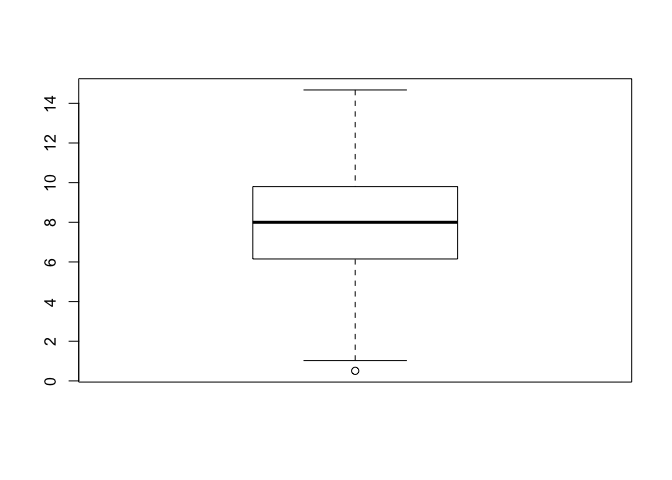
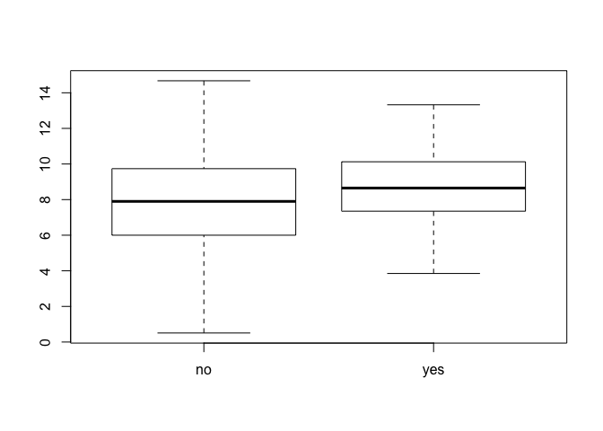
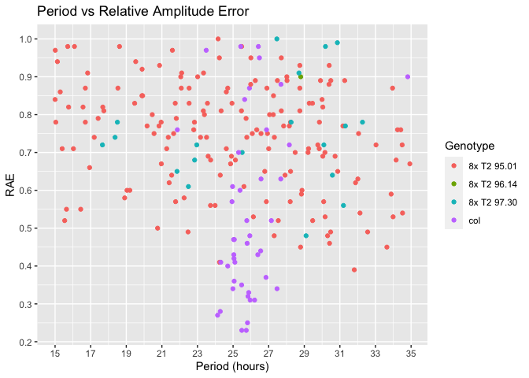
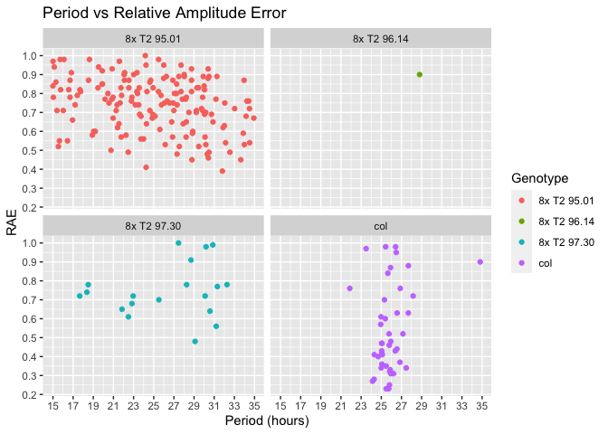
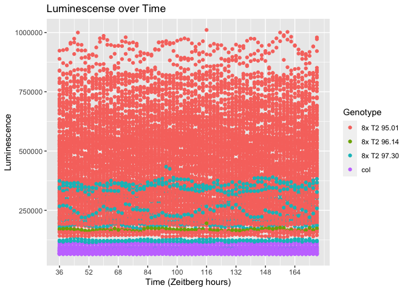

## Video 1

```r
library(tidyverse)
```

```
## Warning: package 'tidyverse' was built under R version 3.5.2
```

```
## ── Attaching packages ───────────────────────────────────────────────────────────────────────────────────────────────────────────────────── tidyverse 1.3.0 ──
```

```
## ✔ ggplot2 3.3.0     ✔ purrr   0.3.3
## ✔ tibble  2.1.3     ✔ dplyr   0.8.5
## ✔ tidyr   1.0.2     ✔ stringr 1.4.0
## ✔ readr   1.3.1     ✔ forcats 0.4.0
```

```
## Warning: package 'ggplot2' was built under R version 3.5.2
```

```
## Warning: package 'tibble' was built under R version 3.5.2
```

```
## Warning: package 'tidyr' was built under R version 3.5.2
```

```
## Warning: package 'purrr' was built under R version 3.5.2
```

```
## Warning: package 'dplyr' was built under R version 3.5.2
```

```
## Warning: package 'stringr' was built under R version 3.5.2
```

```
## Warning: package 'forcats' was built under R version 3.5.2
```

```
## ── Conflicts ──────────────────────────────────────────────────────────────────────────────────────────────────────────────────────── tidyverse_conflicts() ──
## ✖ dplyr::filter() masks stats::filter()
## ✖ dplyr::lag()    masks stats::lag()
```


```r
LungCapData <- read.delim("~/Downloads/LungCapData.txt")
```

```r
view(LungCapData)
```


```r
boxplot(LungCapData$LungCap)
```

<!-- -->

# Ho: mu < 8
# one-sided 95% confidence interval for mu


```r
t.test(LungCapData$LungCap, mu=8, alternative="less", conf.level=0.95)
```

```
## 
## 	One Sample t-test
## 
## data:  LungCapData$LungCap
## t = -1.3842, df = 724, p-value = 0.08336
## alternative hypothesis: true mean is less than 8
## 95 percent confidence interval:
##      -Inf 8.025974
## sample estimates:
## mean of x 
##  7.863148
```
# two-sided

```r
t.test(LungCapData$LungCap, mu=8, alternative="two.side", conf.level=0.95)
```

```
## 
## 	One Sample t-test
## 
## data:  LungCapData$LungCap
## t = -1.3842, df = 724, p-value = 0.1667
## alternative hypothesis: true mean is not equal to 8
## 95 percent confidence interval:
##  7.669052 8.057243
## sample estimates:
## mean of x 
##  7.863148
```
- two sided is the default argument

```r
t.test(LungCapData$LungCap, mu=8, alternative="two.side", conf.level=0.99)
```

```
## 
## 	One Sample t-test
## 
## data:  LungCapData$LungCap
## t = -1.3842, df = 724, p-value = 0.1667
## alternative hypothesis: true mean is not equal to 8
## 99 percent confidence interval:
##  7.607816 8.118479
## sample estimates:
## mean of x 
##  7.863148
```

```r
TEST <- t.test(LungCapData$LungCap, mu=8, alternative="two.side", conf.level=0.99)
```
- Attributes command

```r
attributes(TEST)
```

```
## $names
## [1] "statistic"   "parameter"   "p.value"     "conf.int"    "estimate"   
## [6] "null.value"  "alternative" "method"      "data.name"  
## 
## $class
## [1] "htest"
```

```r
TEST$conf.int
```

```
## [1] 7.607816 8.118479
## attr(,"conf.level")
## [1] 0.99
```

```r
TEST$p.value
```

```
## [1] 0.1667108
```

## Video 2

```r
boxplot(LungCapData$LungCap~LungCapData$Smoke)
```

<!-- -->

# Ho: Mean lung capacity of smokers = of non smokers
# Two-sided test
# assume non-equal variances


```r
t.test(LungCapData$LungCap~LungCapData$Smoke, mu=0, alt="two.sided", conf=0.95, var.eq=F,paired=F)
```

```
## 
## 	Welch Two Sample t-test
## 
## data:  LungCapData$LungCap by LungCapData$Smoke
## t = -3.6498, df = 117.72, p-value = 0.0003927
## alternative hypothesis: true difference in means is not equal to 0
## 95 percent confidence interval:
##  -1.3501778 -0.4003548
## sample estimates:
##  mean in group no mean in group yes 
##          7.770188          8.645455
```
- all arguments above are default!

```r
t.test(LungCapData$LungCap[LungCapData$Smoke == "no"], LungCapData$LungCap[LungCapData$Smoke == "yes"])
```

```
## 
## 	Welch Two Sample t-test
## 
## data:  LungCapData$LungCap[LungCapData$Smoke == "no"] and LungCapData$LungCap[LungCapData$Smoke == "yes"]
## t = -3.6498, df = 117.72, p-value = 0.0003927
## alternative hypothesis: true difference in means is not equal to 0
## 95 percent confidence interval:
##  -1.3501778 -0.4003548
## sample estimates:
## mean of x mean of y 
##  7.770188  8.645455
```

```r
t.test(LungCapData$LungCap~LungCapData$Smoke, mu=0, alt="two.sided", conf=0.95, var.eq=T,paired=F)
```

```
## 
## 	Two Sample t-test
## 
## data:  LungCapData$LungCap by LungCapData$Smoke
## t = -2.7399, df = 723, p-value = 0.006297
## alternative hypothesis: true difference in means is not equal to 0
## 95 percent confidence interval:
##  -1.5024262 -0.2481063
## sample estimates:
##  mean in group no mean in group yes 
##          7.770188          8.645455
```
- how to decided if we should use var.eq= T or F
1. Look at boxplot and see if variance is comparable
2. Use var() to compare

```r
var(LungCapData$LungCap[LungCapData$Smoke == "no"])
```

```
## [1] 7.431694
```

```r
var(LungCapData$LungCap[LungCapData$Smoke == "yes"])
```

```
## [1] 3.545292
```
# Levene's Test
# Ho: population variances are equal


```r
library(car)
```

```
## Warning: package 'car' was built under R version 3.5.2
```

```
## Loading required package: carData
```

```
## Warning: package 'carData' was built under R version 3.5.2
```

```
## 
## Attaching package: 'car'
```

```
## The following object is masked from 'package:dplyr':
## 
##     recode
```

```
## The following object is masked from 'package:purrr':
## 
##     some
```

```r
leveneTest(LungCapData$LungCap~LungCapData$Smoke)
```

```
## Levene's Test for Homogeneity of Variance (center = median)
##        Df F value    Pr(>F)    
## group   1  12.955 0.0003408 ***
##       723                      
## ---
## Signif. codes:  0 '***' 0.001 '**' 0.01 '*' 0.05 '.' 0.1 ' ' 1
```
## Mitchell's Data

```r
Dull.560_All_Results <- read_csv("~/Downloads/Dull 560_All_Results.csv")
```

```
## Parsed with column specification:
## cols(
##   .default = col_double(),
##   Genotype = col_character(),
##   `12` = col_logical(),
##   `14` = col_logical(),
##   `16` = col_logical(),
##   `18` = col_logical(),
##   `20` = col_logical(),
##   `22` = col_logical(),
##   `24` = col_logical(),
##   `26` = col_logical(),
##   `28` = col_logical(),
##   `30` = col_logical(),
##   `32` = col_logical(),
##   `34` = col_logical()
## )
```

```
## See spec(...) for full column specifications.
```


```r
ggplot(Dull.560_All_Results, aes(Period, RAE, color = Genotype))+
  geom_point() + 
  labs(title = "Period vs Relative Amplitude Error",
      x = "Period (hours)",
       y = "RAE")+
  scale_y_continuous(breaks = c(0, .1, .2, .3, .4, .5, .6, .7, .8, .9, 1))+
  scale_x_continuous(breaks = c(15, 17, 19, 21, 23, 25, 27, 29, 31, 33, 35))
```

<!-- -->

```r
ggplot(Dull.560_All_Results, aes(Period, RAE, color = Genotype))+
  geom_point() + 
  labs(title = "Period vs Relative Amplitude Error",
      x = "Period (hours)",
       y = "RAE")+
  scale_y_continuous(breaks = c(0, .1, .2, .3, .4, .5, .6, .7, .8, .9, 1))+
  scale_x_continuous(breaks = c(15, 17, 19, 21, 23, 25, 27, 29, 31, 33, 35))+
  facet_wrap(~Genotype)
```

<!-- -->

```r
RAE_greater <- filter(Dull.560_All_Results, RAE > 0.6)
```

```r
col_data <- filter(RAE_greater, Genotype == "col")
T2_95_01_data <- filter(RAE_greater, Genotype == "8x T2 95.01")
T2_96_14_data <- filter(RAE_greater, Genotype == "8x T2 96.14")
T2_97_30_data <- filter(RAE_greater, Genotype == "8x T2 97.30")
```

```r
view(col_data)
```

```r
view(T2_95_01_data)
```

```r
view(T2_96_14_data)
```

```r
view(T2_97_30_data)
```

```r
summary(col_data$Period)
```

```
##    Min. 1st Qu.  Median    Mean 3rd Qu.    Max. 
##   21.87   25.37   26.42   26.49   27.28   34.81
```

```r
summary(T2_95_01_data$Period)
```

```
##    Min. 1st Qu.  Median    Mean 3rd Qu.    Max. 
##   15.00   21.05   24.89   24.64   28.43   34.93
```

```r
summary(T2_96_14_data$Period)
```

```
##    Min. 1st Qu.  Median    Mean 3rd Qu.    Max. 
##    28.8    28.8    28.8    28.8    28.8    28.8
```

```r
summary(T2_97_30_data$Period)
```

```
##    Min. 1st Qu.  Median    Mean 3rd Qu.    Max. 
##   17.66   22.49   27.46   25.88   30.19   32.27
```

```r
Dull_data <- gather(Dull.560_All_Results, "12":"176", key = "Time", value = "Luminescence")
```

```r
Dull_data$Time<- as.integer(Dull_data$Time)
str(Dull_data)
```

```
## Classes 'tbl_df', 'tbl' and 'data.frame':	18924 obs. of  8 variables:
##  $ Region      : num  119 325 167 73 320 71 116 113 326 79 ...
##  $ Genotype    : chr  "col" "col" "col" "col" ...
##  $ Period      : num  25.5 25.7 25.8 24.1 24.3 ...
##  $ Amplitude   : num  1087 748 1355 1853 1224 ...
##  $ Phase       : num  10.45 11.54 9.56 7.49 9.2 ...
##  $ RAE         : num  0.23 0.23 0.25 0.27 0.28 0.31 0.31 0.32 0.33 0.34 ...
##  $ Time        : int  12 12 12 12 12 12 12 12 12 12 ...
##  $ Luminescence: num  NA NA NA NA NA NA NA NA NA NA ...
```

```r
dull_data <- filter(Dull_data, Time > 35)
head(dull_data)
```

```
## # A tibble: 6 x 8
##   Region Genotype Period Amplitude  Phase   RAE  Time Luminescence
##    <dbl> <chr>     <dbl>     <dbl>  <dbl> <dbl> <int>        <dbl>
## 1    119 col        25.5     1087   10.4   0.23    36       67713.
## 2    325 col        25.7      748.  11.5   0.23    36       66402.
## 3    167 col        25.8     1355    9.56  0.25    36       90814.
## 4     73 col        24.1     1853    7.49  0.27    36      112052.
## 5    320 col        24.3     1224    9.2   0.28    36       89739.
## 6     71 col        26.0      896. -12.7   0.31    36       98887.
```

```r
ggplot(dull_data, aes(Time, Luminescence, color = Genotype))+
  geom_point()+
  labs(title = "Luminescense over Time",
      x = "Time (Zeitberg hours)",
       y = "Luminescence")+
  #scale_y_continuous(breaks = c(0, .1, .2, .3, .4, .5, .6, .7, .8, .9, 1))+
  scale_x_continuous(breaks = seq(36,176, 16))
```

<!-- -->
